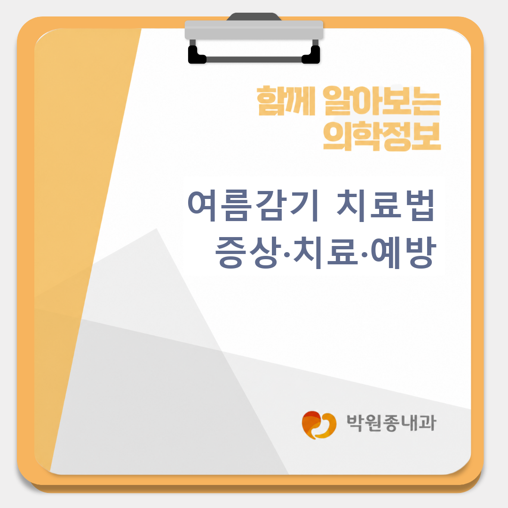
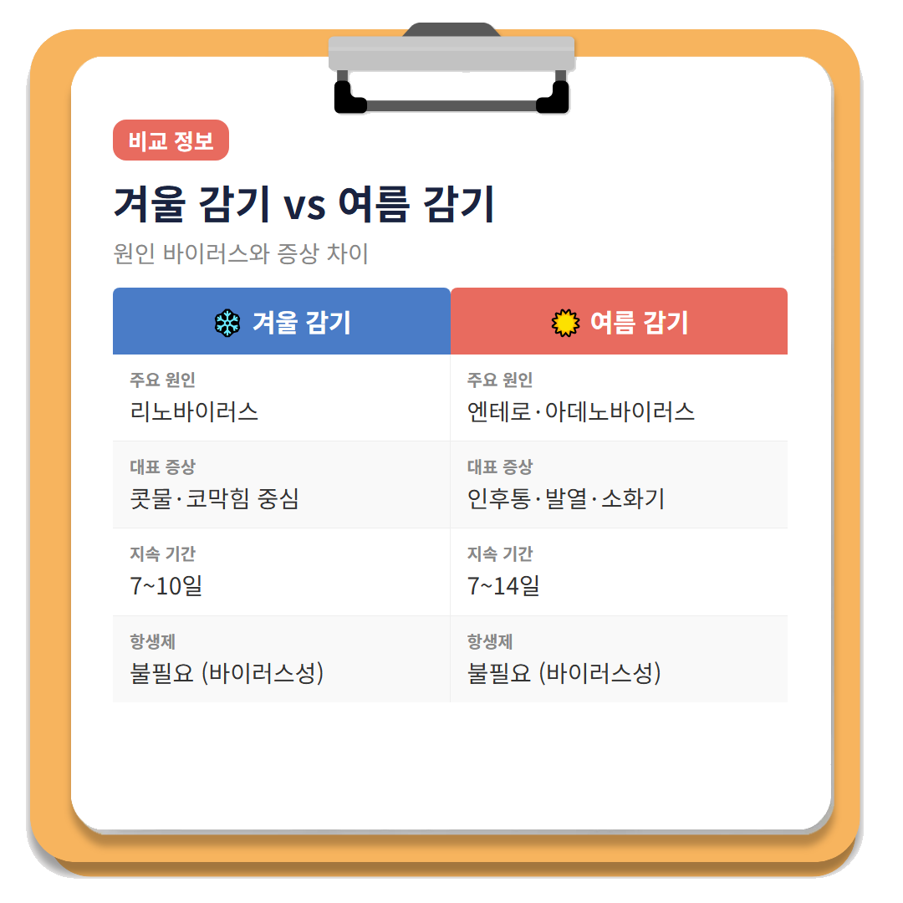
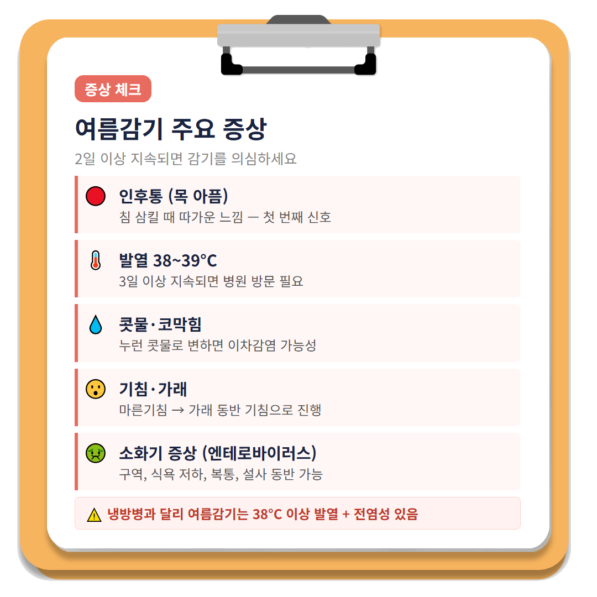
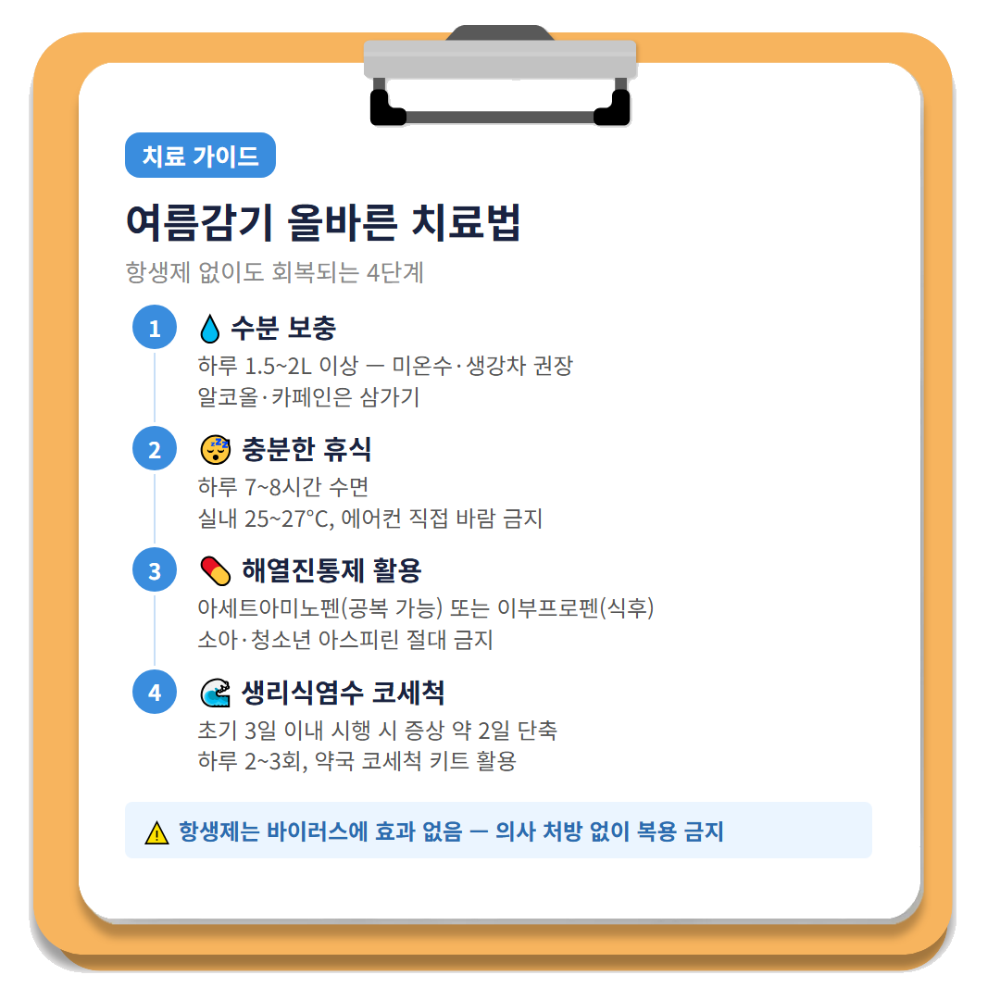
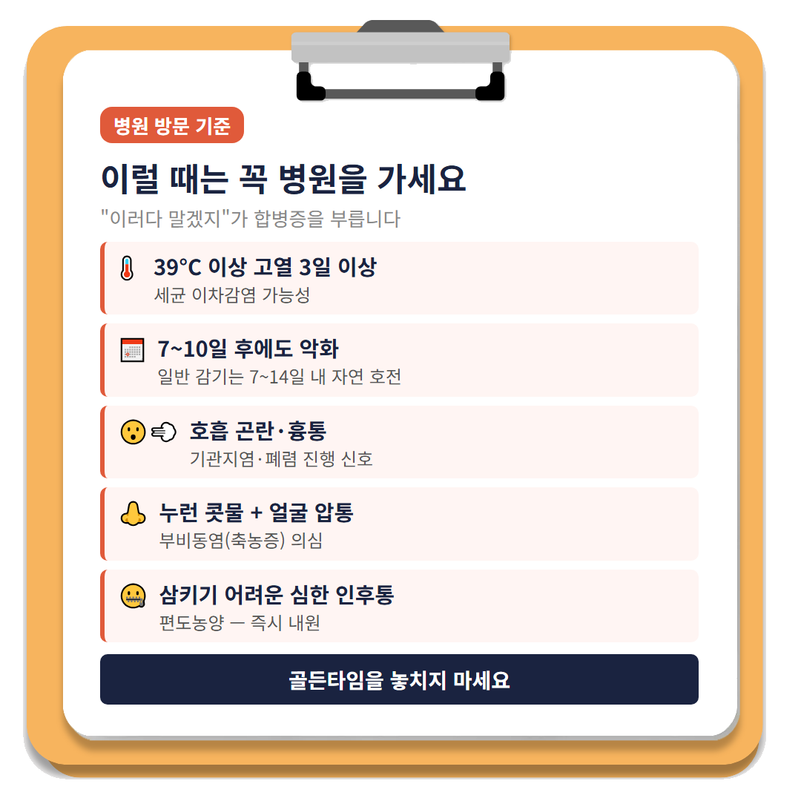
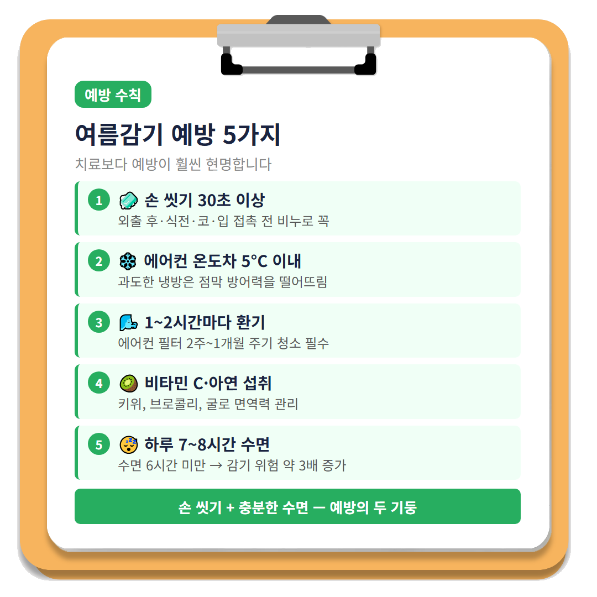

# 여름감기 치료법과 예방 수칙, 이것만 알면 됩니다

안녕하세요! 여러분의 건강 주치의 박원종 내과입니다. 😊

"에이, 여름에 무슨 감기야~" 하고 대수롭지 않게 넘기셨나요? 실제로 많은 분들이 여름에 목이 칼칼하고 코가 훌쩍거려도 **"더위 먹었겠지"**, **"에어컨 바람 때문이겠지"** 하며 방치하시는 경우가 많습니다.

하지만 여름감기는 겨울 감기와 원인 바이러스가 다르고, 소화기 증상까지 동반하는 경우가 있어 자칫 치료 시기를 놓치면 **부비동염(副鼻洞炎, 축농증), 편도염, 기관지염** 등 합병증으로 이어질 수 있습니다.

오늘은 여름감기의 원인, 증상, 올바른 치료법, 그리고 냉방병과 구별하는 법까지 꼼꼼하게 정리해 드리겠습니다!

---

## 1. 🦠 여름감기, 겨울 감기와 무엇이 다를까요?

여름감기의 주요 원인은 **엔테로바이러스(Enterovirus)**와 **아데노바이러스(Adenovirus)**입니다. 겨울 감기가 리노바이러스 중심이라면, 여름 감기는 이 두 바이러스가 앞장섭니다.

특히 엔테로바이러스는 분변-구강 경로로도 전파되기 때문에 **손 씻기**를 소홀히 하면 급식·수영장 등 공동 이용 시설에서 집단 감염으로 번질 수 있습니다. 아데노바이러스는 결막염(눈곱)을 동반한 '인두결막열'을 일으키기도 합니다.

그렇다고 리노바이러스가 없는 건 아닙니다. 여름 감기 환자의 25~40%는 리노바이러스가 원인이며 [CDC, 2024], 에어컨이 켜진 밀폐 공간은 여름에도 리노바이러스가 번성하기 좋은 환경을 만듭니다.

**겨울 감기 vs 여름 감기 한눈에 비교**

| 구분 | 겨울 감기 | 여름 감기 |
|------|-----------|-----------|
| 주요 원인 | 리노바이러스 | 엔테로바이러스·아데노바이러스 |
| 두드러진 증상 | 콧물·코막힘 | 인후통·발열·소화기 증상 동반 |
| 지속 기간 | 7~10일 | 7~14일 |
| 전파 경로 | 비말·접촉 | 비말 + 분변-구강 경로 가능 |

---

## 2. 🌡️ 여름감기 주요 증상 체크리스트

아래 증상들이 나타난다면 여름감기를 의심해 보세요.

- **인후통(목 아픔)**: 가장 먼저 나타납니다. 침을 삼킬 때 따가운 느낌이 시작 신호입니다.
- **발열**: 38~39°C 수준. **고열이 3일 이상 지속**된다면 빨리 병원을 찾아야 합니다.
- **콧물·코막힘**: 처음엔 맑은 콧물, 이후 누런 콧물로 변하면 세균 이차감염 가능성이 있습니다.
- **기침·가래**: 인두 자극에 의한 마른기침으로 시작해 가래를 동반하는 기침으로 이어집니다.
- **두통·근육통·피로감**: 바이러스가 전신 염증 반응을 일으키기 때문에 으슬으슬하고 온몸이 쑤시는 느낌이 납니다.
- **소화기 증상**: 엔테로바이러스 감염 시 구역, 식욕 저하, 복통, 설사가 동반되기도 합니다.

"목만 좀 아픈 것 같은데 감기는 아니겠지..." 하고 넘기시는 분들이 많으시죠? 바로 이 인후통이 여름감기의 대표 신호입니다. **인후통이 이틀 이상 지속된다면 가볍게 보지 마세요.**

---

## Q. 여름 콧물·기침이 감기인지 냉방병인지 어떻게 구별하나요?

냉방병과 여름감기를 혼동하시는 분들이 정말 많습니다. 가장 쉬운 구별법은 **발열 유무**와 **전염성**입니다.

냉방병은 실내외 과도한 온도차와 에어컨의 건조한 공기가 원인이어서 **발열이 없거나 미열에 그치고**, 주변 사람에게 옮지 않습니다. 반면 여름감기는 **바이러스 감염이므로 38°C 이상 발열이 뚜렷**하고, 가족이나 직장 동료에게 전파될 수 있습니다.

| 구분 | 여름감기 | 냉방병 |
|------|----------|--------|
| 발열 | 38°C 이상 | 없거나 미열 |
| 인후통 | 뚜렷함 | 경미(건조한 느낌) |
| 전염성 | 있음 | 없음 |
| 회복 기간 | 7~14일 | 에어컨 노출 줄이면 수일 내 호전 |

에어컨 없는 곳에서도 증상이 계속되고 열이 난다면 감기를 먼저 의심하세요.

---

## 3. 💊 여름감기 올바른 치료법

### 항생제는 필요 없습니다

여름감기는 **바이러스성 질환**입니다. 세균을 죽이는 항생제는 바이러스에 전혀 효과가 없습니다. 오히려 임의로 항생제를 복용하면 장내 유익균이 죽고, **항생제 내성균** 발생 위험이 높아집니다. [대한감염학회, 2024]

"약국에서 종합감기약 샀는데 항생제 아닌가요?"라고 물으시는 분들이 계시는데, 일반 시판 종합감기약은 항생제가 아닌 **해열·진통·항히스타민·기침 억제 성분**의 복합제입니다. 이것은 증상 완화에 도움이 됩니다.

### ① 충분한 수분 보충

**하루 1.5~2L 이상** 물을 마시세요. 기도 점막이 촉촉하게 유지되어야 바이러스 배출이 원활해지고 자연 회복이 빨라집니다. [대한가정의학회, 2023]

따뜻한 생강차·꿀물·미온수가 인후통 완화에 특히 좋습니다. 반면 **알코올·카페인 음료**는 이뇨 작용으로 탈수를 악화시키니 감기 중에는 삼가시기 바랍니다.

### ② 충분한 휴식과 체온 관리

무리한 활동은 면역 기능을 떨어뜨려 회복을 지연시킵니다. 하루 7~8시간 충분히 주무시고, 에어컨 직접 바람이 몸에 닿지 않도록 주의하세요. 실내 온도는 25~27°C로 유지하는 것이 좋습니다.

### ③ 해열진통제 활용

발열과 인후통이 심하다면 해열진통제를 드셔도 됩니다.

- **아세트아미노펜(타이레놀류)**: 위 자극이 적어 공복에도 복용 가능, 성인 기준 1회 500~1,000mg 1일 3~4회
- **이부프로펜(부루펜류)**: 소염 효과도 있어 인후통·근육통에 효과적, 반드시 식후 복용

소아·청소년에게 **아스피린은 금기**입니다. 라이 증후군(뇌·간 손상) 위험이 있기 때문입니다. [질병관리청, 2025]

### ④ 생리식염수 코세척

감기 초기 3일 이내에 생리식염수 코세척을 시행하면 증상 기간을 **평균 약 2일 단축**할 수 있다는 코크란 리뷰(2024) 결과가 있습니다. 약국에서 구입 가능한 코세척 키트를 활용해 하루 2~3회 씻어내 주세요.

---

## 4. 🚨 이럴 때는 반드시 병원을 방문하세요

아래 증상이 하나라도 있다면 가까운 내과·병원을 찾으셔야 합니다.

- **39°C 이상 고열이 3일 이상 지속**될 때
- **7~10일이 지나도 호전이 없거나 오히려 악화**될 때
- 호흡 곤란, 흉통, 가슴이 짓눌리는 느낌이 있을 때
- **누런·녹색 콧물 + 이마·뺨 부위 압통** (부비동염 의심)
- 침을 삼키기 힘들 정도의 심한 인후통 (편도농양 의심)
- 소아에서 **경련, 의식 저하, 심한 두통** 동반 시

**"이러다 말겠지"** 하고 방치하시면 단순 감기가 부비동염(축농증)이나 기관지염으로 악화될 수 있습니다. **골든타임을 놓치지 마세요.**

---

## 5. 🛡️ 여름감기 예방 수칙 5가지

치료보다 예방이 훨씬 현명하겠죠? 다음 5가지를 꼭 기억해 주세요.

1. **손 씻기**: 비누와 흐르는 물로 30초 이상, 외출 후·식전·코·입 접촉 전 필수입니다.
2. **에어컨 관리**: 실내외 온도차 5°C 이내 유지, 필터는 2주~1개월 주기로 청소하세요.
3. **환기**: 1~2시간 간격으로 창문을 열어 신선한 공기를 들이세요. 에어컨 직접 바람은 몸에 닿지 않게 하세요.
4. **면역력 관리**: 비타민 C·아연이 풍부한 식품(키위, 브로콜리, 굴)을 챙겨 드시고, 중강도 유산소 운동을 꾸준히 하세요.
5. **충분한 수면**: 하루 6시간 미만 수면자는 7시간 이상 수면자 대비 감기 발생률이 **약 3배** 높다는 연구 결과가 있습니다. [Cohen S. et al., JAMA Internal Medicine, 2023] 여름이라도 수면만큼은 절대 양보하지 마세요.

---

## ✅ 여름감기 핵심 정리

| 항목 | 핵심 내용 |
|------|----------|
| 주요 원인 | 엔테로바이러스·아데노바이러스 (리노바이러스도 30~40%) |
| 냉방병 구별법 | 발열 38°C↑ + 전염성 있으면 감기 |
| 치료 핵심 | 항생제 불필요, 수분·휴식·해열진통제·코세척 |
| 병원 방문 기준 | 39°C↑ 3일 이상, 7~10일 후에도 악화, 호흡 곤란 |
| 예방 1순위 | 손 씻기 + 충분한 수면 |

> **"여름 감기는 낫는 병입니다. 하지만 방치는 안 낫게 만드는 선택입니다."**

몸이 신호를 보내고 있을 때 조금만 더 일찍 가까운 내과를 방문해 주세요. 전문의와 상담하면 불필요한 항생제 없이도 훨씬 빠르고 안전하게 회복할 수 있습니다.

---

※ 모든 치료 및 예방접종은 개인의 상태에 따라 발열, 통증, 알레르기 반응 등의 부작용이 나타날 수 있으므로, 반드시 의료진과 충분한 상담 후 진행하시기 바랍니다.

박원종 내과에서 전해드리는 건강 정보였습니다. 오늘도 건강하고 평안한 하루 보내세요!

---

#여름감기 #여름감기치료 #감기증상 #여름감기예방 #냉방병구별 #엔테로바이러스 #내과
