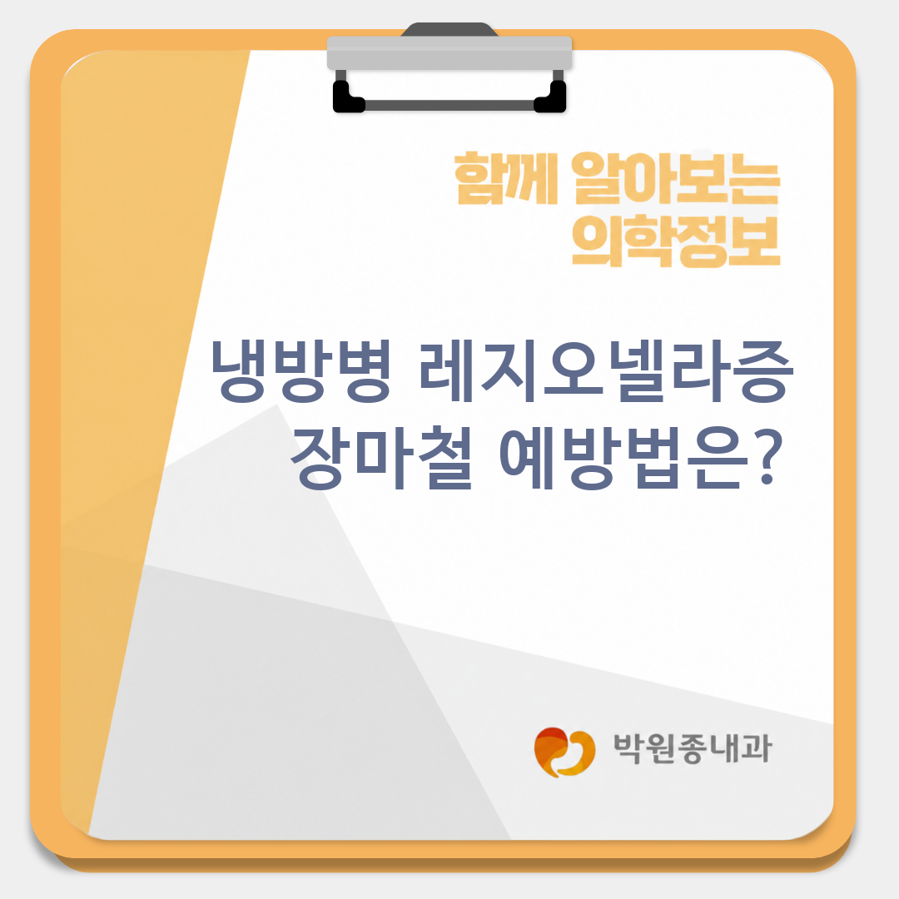
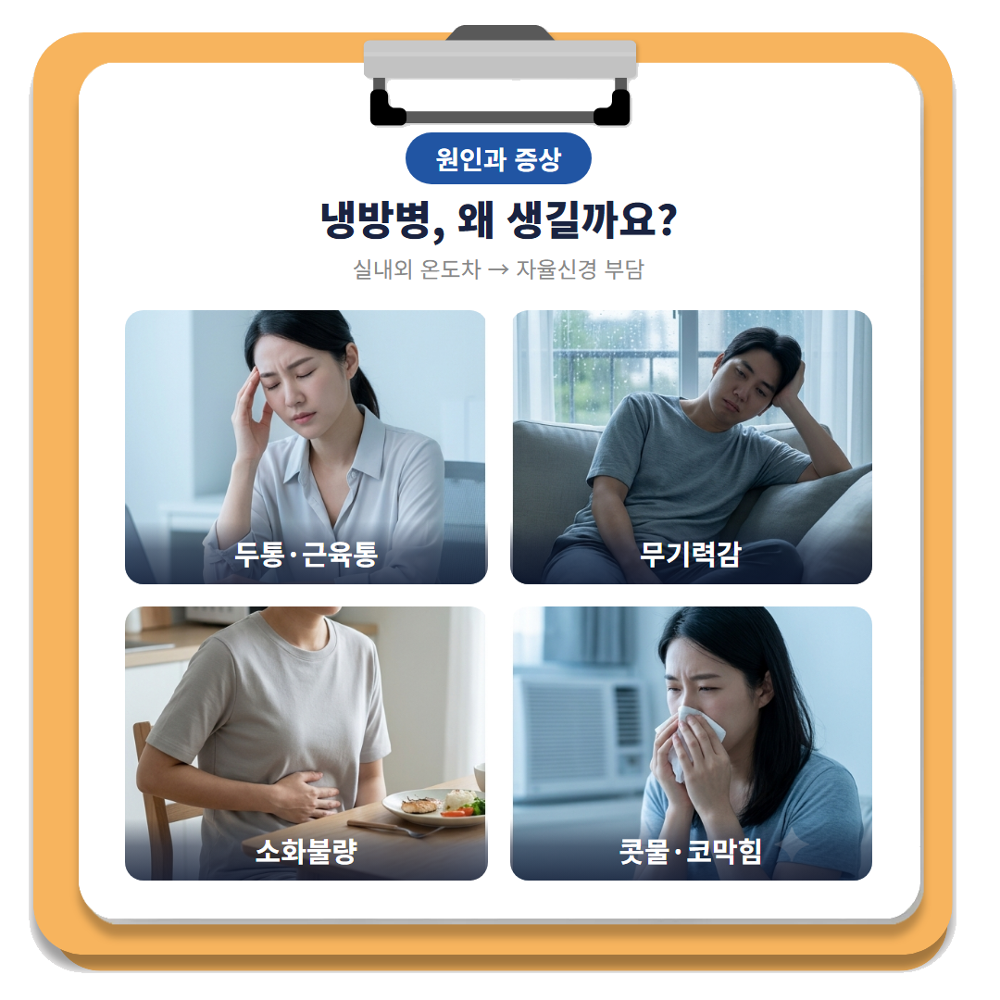
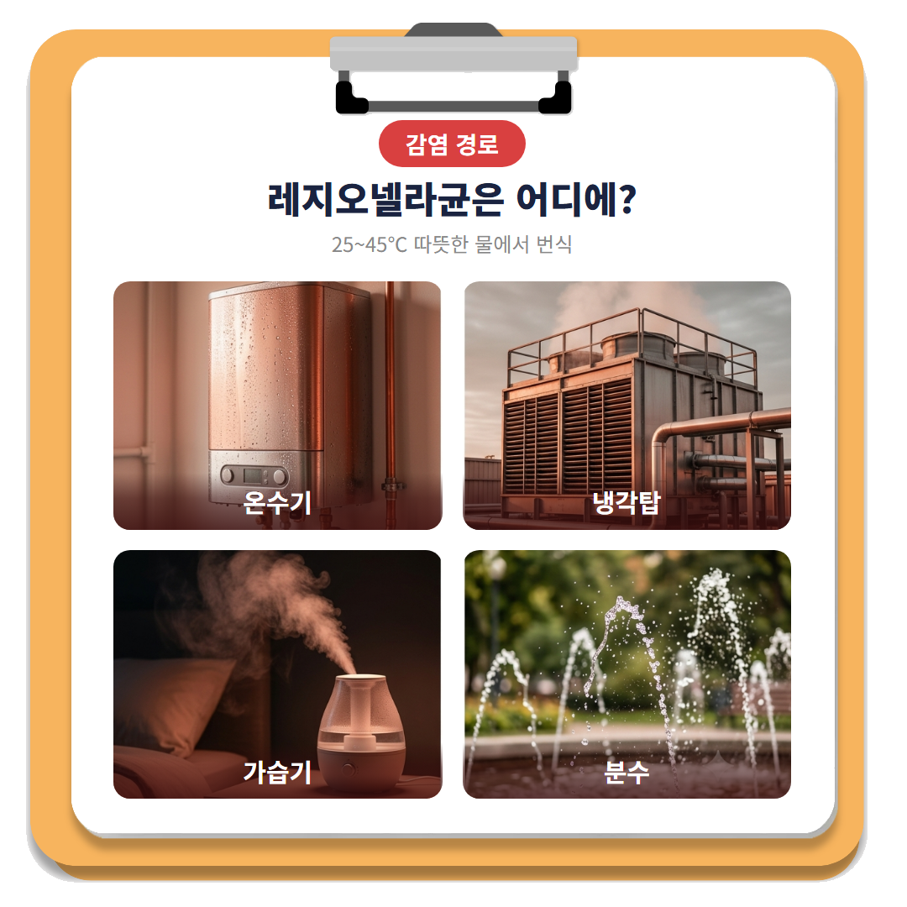
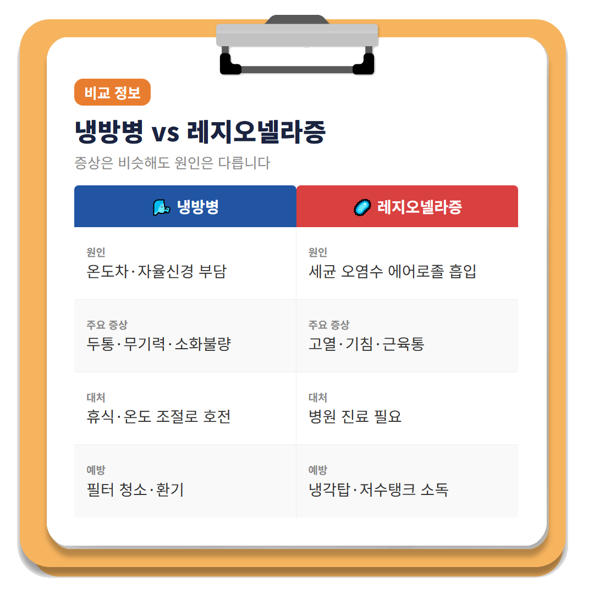
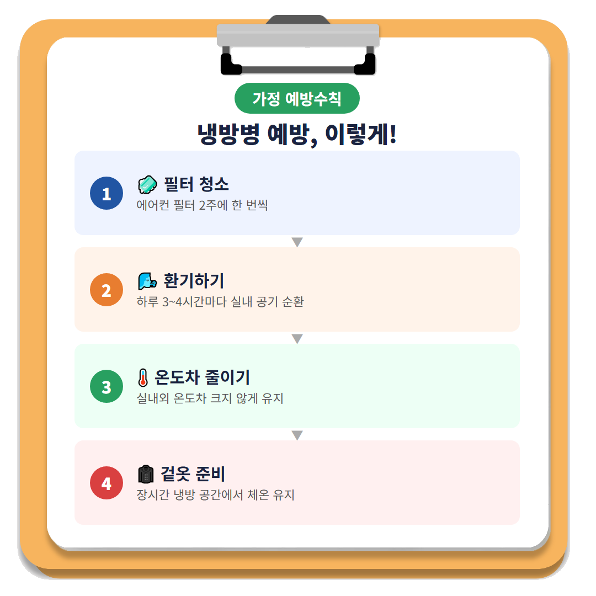
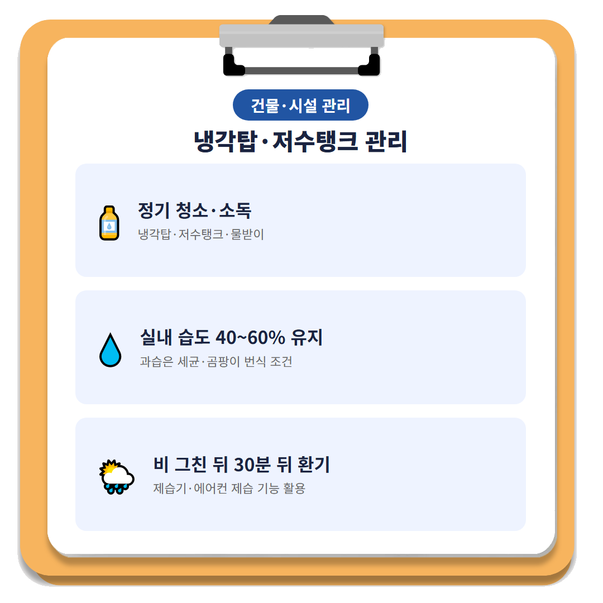
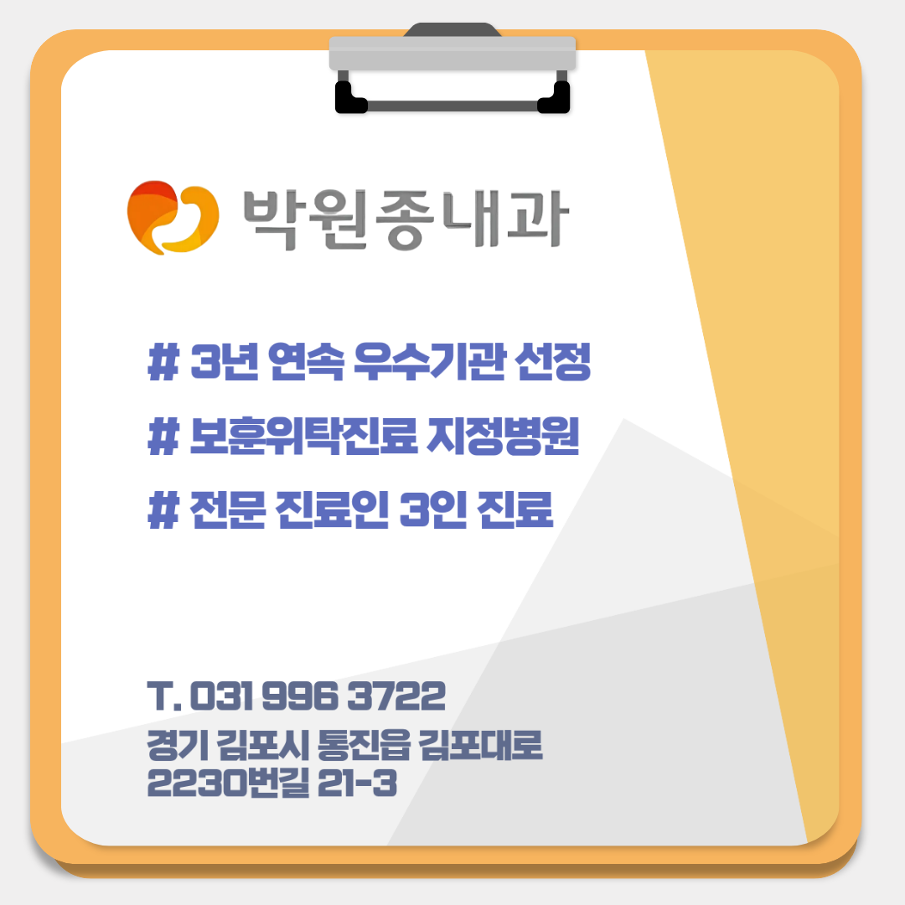

# [통진읍의원박원종내과] 냉방병 레지오넬라증, 장마철 예방법은?

안녕하세요! 여러분의 건강 주치의 박원종 내과입니다. 😊

후텁지근한 장마철, 실내에서는 냉방병 때문에 고생하는 분들 많으시죠? 밖은 습하고 찜통 같은데 실내는 에어컨 바람 때문에 으슬으슬할 정도로 서늘한 곳도 많습니다. 그런데 며칠째 몸이 무겁고 두통이 가시지 않는다면, 단순히 "냉방병이겠지" 하고 넘기고 계시진 않나요?

문제는 냉방병과 겉보기 증상이 비슷한 **레지오넬라증**이라는 감염병이 실제로 존재한다는 점입니다. 두 질환은 초기 증상만으로 구분하기가 쉽지 않아, 방치하다가 뒤늦게 병원을 찾는 경우도 있습니다. 오늘은 장마철·여름철 냉방병과 레지오넬라증의 차이, 그리고 가정과 일상에서 실천할 수 있는 예방법을 자세히 알려드리겠습니다.

---

## 1. 🌬️ 냉방병, 왜 생기고 어떤 증상이 있나요?

냉방병은 실내외 온도차가 크거나 에어컨 바람에 장시간 노출될 때 우리 몸의 체온 조절 기능과 자율신경계에 부담이 가면서 나타나는 증상을 통틀어 부르는 말입니다. 두통, 몸살 같은 근육통, 무기력감, 소화불량, 콧물·코막힘 등 감기와 비슷한 증상이 흔하게 나타납니다.

**"에어컨 좀 튼 것뿐인데 왜 이렇게 몸이 축 처지지?"** 하고 의아해하시는 분들 많으시죠? 문제는 이런 증상을 그냥 "냉방병이겠지" 하고 며칠 더 버티다가, 실제로는 다른 원인이 숨어 있는 경우를 놓칠 수 있다는 점입니다.

---

## 2. 🦠 냉방병과 헷갈리는 레지오넬라증이란?

레지오넬라균은 **25~45℃ 정도의 따뜻한 물에서 특히 잘 번식**하는 세균으로, 온수기·에어컨 냉각탑·가습기·분수 등 물이 고이거나 순환하는 설비 곳곳에 서식할 수 있습니다. 이 균에 오염된 물에서 발생한 미세한 물방울(에어로졸)을 사람이 들이마시면 레지오넬라증(Legionellosis, 레지오넬라균에 의한 호흡기 감염병)에 감염될 수 있습니다.

문제는 **레지오넬라증 초기 증상이 냉방병·몸살감기와 매우 비슷하다**는 점입니다. 발열, 두통, 근육통, 기침 같은 증상만으로는 두 질환을 구분하기가 쉽지 않습니다. 그래서 "그냥 냉방병이겠지" 하며 방치하다가 증상이 장기간 지속되고 나서야 병원을 찾는 경우가 생깁니다. **증상이 며칠 이상 이어지거나 점점 심해진다면 가볍게 넘기지 마세요.**

---

## Q. 냉방병과 레지오넬라증, 집에서 구분할 수 있나요?

일반적인 증상만으로는 두 질환을 명확히 구분하기 어렵습니다. 특히 발열과 근육통, 두통이 함께 나타나면서 며칠이 지나도 나아지지 않거나 오히려 심해진다면 단순 냉방병이 아닐 가능성도 염두에 두어야 합니다. 이런 경우에는 자가 판단보다 **가까운 내과에서 진료를 받아보시는 것**이 안전합니다.

레지오넬라증은 원인균과 감염 경로가 감기나 단순 냉방병과 전혀 다르기 때문에, 증상이 비슷하다고 해서 똑같이 대처해서는 안 됩니다. **"며칠 쉬면 낫겠지"라며 참고 넘어가는 습관을 가볍게 보지 마세요.** 특히 면역력이 약한 어르신이나 기저질환이 있는 분들은 증상이 오래갈 경우 더욱 유의하셔야 합니다.

---

## 3. 🧊 가정에서 실천하는 냉방병·레지오넬라증 예방법

가정에서 지킬 수 있는 예방 수칙은 생각보다 간단합니다. 다만 꾸준히 실천하는 것이 핵심입니다.

- **에어컨 필터는 2주에 한 번씩 청소**해 먼지와 세균이 쌓이지 않도록 관리합니다.
- **하루 3~4시간마다 환기**해 실내 공기를 순환시키고 냉방기기 내부 습기를 줄입니다.
- 실내외 온도차가 너무 크지 않게 유지하고, 냉방 바람이 몸에 직접 닿지 않도록 방향을 조절합니다.
- 장시간 냉방 공간에 있을 때는 얇은 겉옷을 준비해 체온 저하를 막습니다.

특히 환기는 단순히 답답함을 없애는 차원이 아니라, 냉방기기 내부에 세균이 번식할 수 있는 습한 환경 자체를 줄여준다는 점에서 꼭 챙기셔야 하는 습관입니다.

---

## 4. 🏢 건물·시설에서는 이렇게 관리해야 합니다

가정용 에어컨뿐 아니라 건물 단위의 냉방·급수 설비 관리도 중요합니다. 특히 **냉각탑, 저수탱크, 물받이** 등은 레지오넬라균이 번식하기 좋은 환경이 될 수 있어 정기적인 청소·소독이 필요합니다. 다중이용시설이나 사무실 건물이라면 관리자가 주기적인 점검 일정을 정해두는 것이 바람직합니다.

실내 습도 역시 함께 관리해야 합니다. 여러 자료에서 공통적으로 제시하는 적정 실내 습도 범위는 **40~60%**이며, 이 범위를 벗어나 지나치게 습해지면 각종 세균·곰팡이 번식 조건이 좋아질 수 있습니다. 비가 그친 뒤 30분 이상 지나서 환기하고, 제습기나 에어컨의 제습 기능을 함께 활용하는 것이 실내 습도 관리에 도움이 됩니다.

---

## ✅ 냉방병·레지오넬라증 예방 체크리스트

| 항목 | 핵심 행동 |
|------|----------|
| 에어컨 필터 | 2주에 1회 청소 |
| 환기 | 하루 3~4시간마다, 비 그친 후 30분 뒤 |
| 실내 습도 | 40~60% 유지 |
| 냉방 온도차 | 실내외 온도차 크지 않게 유지 |
| 건물 설비 | 냉각탑·저수탱크·물받이 정기 청소·소독 |
| 증상 지속 시 | 자가 판단 대신 가까운 내과 진료 |

> **"냉방병과 레지오넬라증은 증상이 닮았어도, 대처법은 같지 않습니다."**

장마철·여름철에는 냉방 없이 지내기 힘든 만큼, 냉방기기를 깨끗하게 관리하고 실내 습도를 조절하는 습관이 무엇보다 중요합니다. 만약 두통, 발열, 근육통 같은 증상이 며칠 이상 이어지거나 점점 심해진다면 단순 냉방병으로 단정하지 마시고, **가까운 내과를 방문해 정확한 진료를 받아보시기 바랍니다.**

---

※ 모든 치료 및 예방접종은 개인의 상태에 따라 발열, 통증, 알레르기 반응 등의 부작용이 나타날 수 있으므로, 반드시 의료진과 충분한 상담 후 진행하시기 바랍니다.

박원종 내과에서 전해드리는 건강 정보였습니다. 오늘도 건강하고 평안한 하루 보내세요!

---

#냉방병 #통진냉방병 #레지오넬라증 #통진레지오넬라증 #장마철건강관리 #통진장마철건강관리 #에어컨필터청소
#통진읍내과 #통진읍의원 #통진읍내과의원 #마송내과 #마송의원 #마송내과의원 #마송리내과 #마송리의원 #마송리내과의원 #통진시장내과 #통진시장의원 #통진시장내과의원 #마송주공내과 #마송주공의원 #마송주공내과의원 #통진농협내과 #통진농협의원 #통진농협내과의원 #마송3리내과 #마송3리의원 #마송3리내과의원 #마송사거리내과 #마송사거리의원 #마송사거리내과의원 #신김포농협내과 #신김포농협의원 #신김포농협내과의원 #위내시경 #대장내시경 #검진
