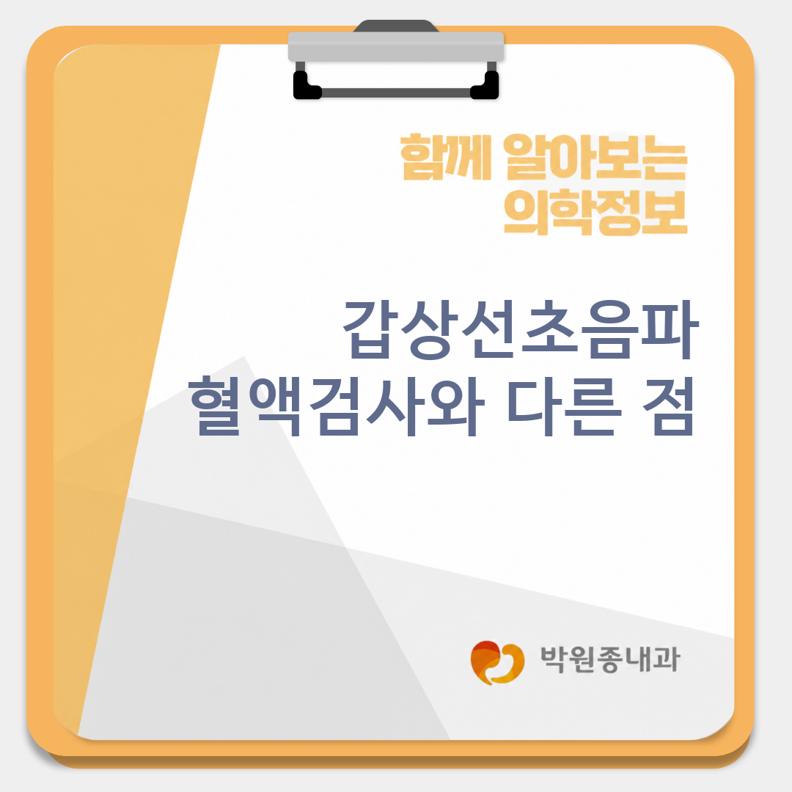
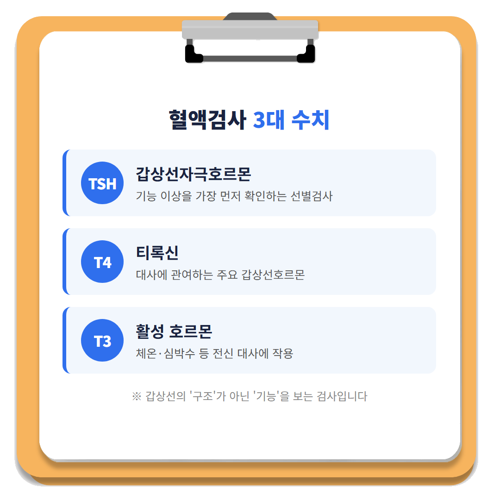
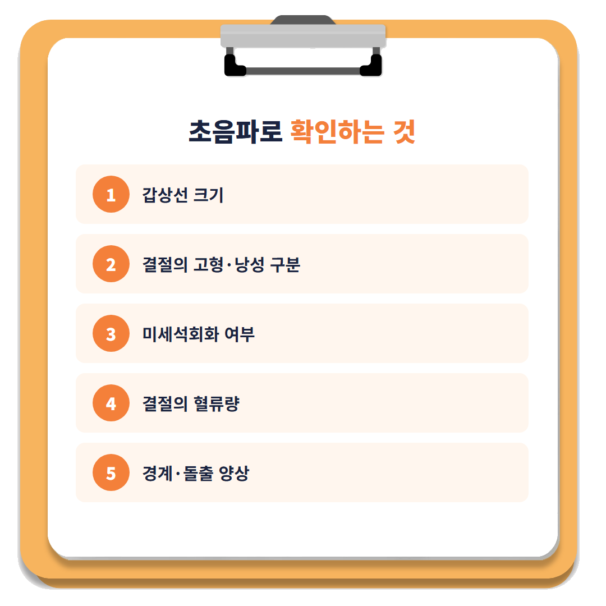
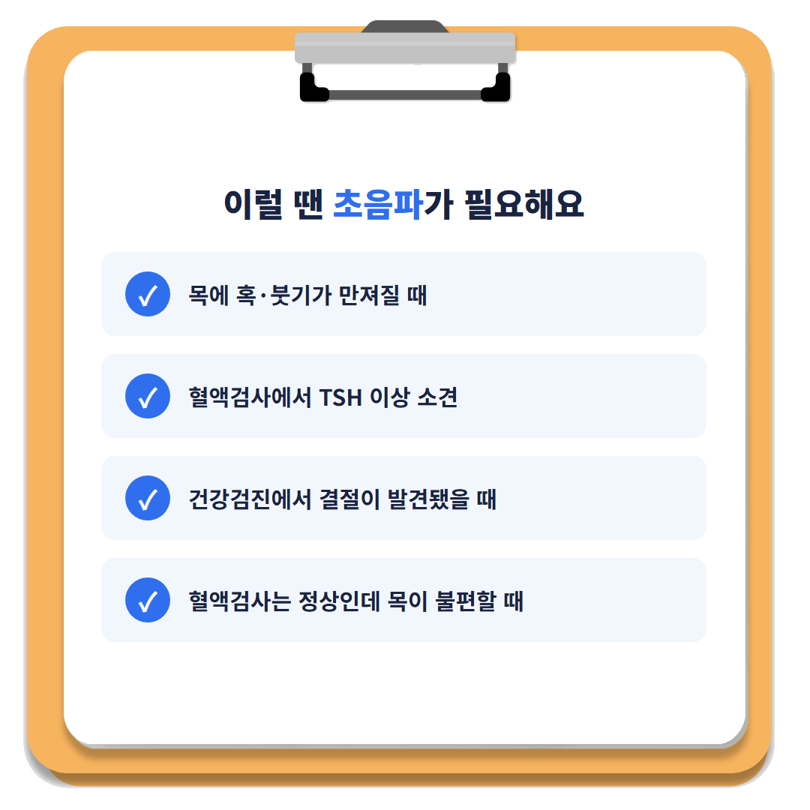
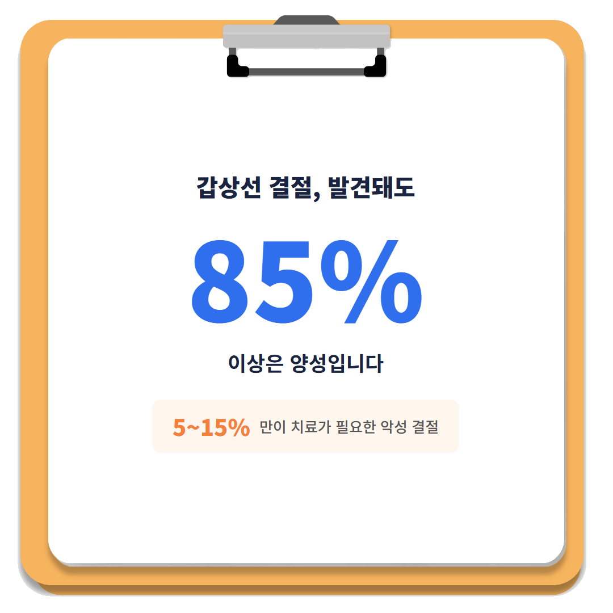

# [통진읍내과의원박원종내과] 갑상선초음파, 혈액검사와 다른 점은?

안녕하세요! 여러분의 건강 주치의 박원종 내과입니다. 😊

건강검진에서 **갑상선초음파**를 따로 권유받은 적 있으신가요? "TSH 수치가 정상이네요"라는 한마디에 마음이 놓이셨던 분들 많으시죠? 그런데 **"피검사가 정상이니까 갑상선은 문제없겠지"** 라고 생각하며, 목에 만져지는 혹이나 붓기를 대수롭지 않게 넘기고 계시진 않나요?

사실 혈액검사와 초음파검사는 갑상선의 서로 다른 면을 들여다보는 검사입니다. 하나가 정상이라고 해서 다른 하나까지 정상이라는 뜻은 아닙니다. 오늘은 **갑상선초음파**와 혈액검사(TSH·T3·T4)가 각각 무엇을 보여주는지, 그리고 초음파는 언제·왜 받아야 하는지 자세히 알려드리겠습니다.

---

## 1. 🩸 혈액검사(TSH·T3·T4)가 알려주는 것

혈액검사는 갑상선의 **'기능'**을 평가하는 검사입니다. **TSH(갑상선자극호르몬)**는 뇌하수체에서 분비되어 갑상선의 호르몬 분비량을 조절하는 지표로, 갑상선 기능 이상을 가장 먼저 확인하는 선별 검사로 활용됩니다. TSH가 정상 범위라면 통상 추가 검사가 필요하지 않지만, 수치가 비정상이면 유리 T4(Free T4) 등을 추가로 확인하게 됩니다.

**T4(티록신)**는 우리 몸의 대사에 관여하는 주요 갑상선호르몬이며, 이후 더 활성이 강한 **T3**로 전환되어 체온·심박수·성장 등 전신 대사 과정에 폭넓게 관여합니다. 즉 혈액검사는 갑상선이 "얼마나 열심히 일하고 있는지"를 숫자로 보여주는 검사인 셈입니다.

하지만 여기서 중요한 한계가 있습니다. **혈액검사는 갑상선의 크기·모양·혹(결절)·염증 유무 같은 '구조적' 이상은 전혀 확인하지 못한다**는 점입니다. 하시모토 갑상선염 같은 자가면역 갑상선질환도 일반적인 기능검사만으로는 진단되지 않으며, 항사이로글로불린항체(TgAb)·항갑상선과산화효소항체(TPOAb) 같은 별도의 자가면역항체 검사가 필요합니다.

---

## 2. 🔍 초음파 검사로 추가로 확인할 수 있는 것

혈액검사가 '기능'을 본다면, **초음파검사는 갑상선의 '구조'를 직접 눈으로 확인하는 검사**입니다. 음파를 이용해 갑상선의 크기를 측정하고, 혹(결절)이 발견되면 이것이 고형인지 물이 찬 낭성 병변인지 구분하며, 결절 내부의 미세석회화 여부와 혈류량, 돌출 양상까지 세밀하게 관찰합니다.

갑상선염이 있는 경우에는 초음파에서 실질 에코가 감소하고 소엽 구조가 과장되어 보이는 등 특징적인 소견이 나타나기도 합니다. 다만 **초음파만으로 하시모토갑상선염을 확진할 수는 없으며**, 초음파 소견으로 '의심'한 뒤 자가항체 혈액검사로 확진하는 방식이 일반적입니다. 즉 혈액검사와 초음파는 경쟁 관계가 아니라 **서로의 빈틈을 채워주는 보완 관계**라고 이해하시면 됩니다.

국내에서는 **K-TIRADS(대한갑상선영상의학회 기준)**라는 분류 체계를 통해 결절의 내부 구성, 에코 강도, 미세석회화·경계 모양 등을 종합해 결절을 1~5등급(양성~고위험 의심)으로 나눕니다. 등급이 높을수록 정밀검사가 필요할 가능성이 커지는 구조입니다.

---

## Q. 초음파는 언제 받아야 하나요?

**목에 혹이 만져지거나(촉진상 이상), 혈액검사에서 갑상선 기능 이상이 먼저 확인된 경우** 초음파검사를 시행하는 것이 일반적입니다. 갑상선초음파는 기능 평가 자체에 필요한 검사가 아니라, 신체검사나 혈액검사에서 이상이 발견되었을 때 형태학적 이상 여부를 확인하기 위해 시행하는 검사이기 때문입니다.

실제로 결절이 발견된 경우의 진료 순서도 이 원칙을 따릅니다. 병력청취와 신체검사 후 TSH를 포함한 혈액검사를 먼저 시행하고, 이어서 초음파검사를 통해 세침흡인검사(FNA, 가는 바늘로 세포를 채취해 조직을 확인하는 검사)가 필요한지, 아니면 경과관찰로 충분한지를 판단하게 됩니다. **"목에 뭔가 만져지는데 굳이 병원까지 가야 하나"** 하고 망설이시는 분들도 많은데, 촉진 이상이 있다면 미루지 말고 확인해 보시는 것이 안전합니다.

---

## 3. 🧬 갑상선 결절, 발견되면 크게 걱정해야 할까?

촉진만으로 발견되는 갑상선 결절의 유병률은 전체 인구의 **4~7%** 수준으로 알려져 있습니다. 그런데 고해상도 초음파가 널리 보급된 이후에는 실제 발견율이 훨씬 높아, **성인의 50~60%에서 결절이 관찰될 정도**로 매우 흔한 소견이 되었습니다.

여기서 꼭 기억하셔야 할 부분이 있습니다. 발견된 결절 중 **85% 이상은 양성**이며, 치료가 필요한 악성 결절은 전체의 **5~15% 수준**에 그친다는 점입니다. 결절이 있다는 말을 들으면 덜컥 겁부터 나실 수 있지만, 실제로는 추적관찰만으로 충분한 경우가 대다수라는 뜻입니다.

크기 기준도 참고할 만합니다. K-TIRADS 등급에 따라 **3등급은 1.5cm 이상, 4·5등급은 1.0cm 이상**일 때 세침흡인검사가 권고되며, **0.5cm 이하의 작은 결절**은 고위험 소견이 없다면 대부분 예후가 양호해 조직검사를 서두르지 않습니다. 다만 크기가 작아도 림프절 전이나 피막 침범이 의심되는 고위험 소견이 있다면 크기와 무관하게 정밀검사가 고려될 수 있으므로, 결절이 발견되면 등급과 소견에 따라 전문의와 상의하는 과정이 꼭 필요합니다.

---

## ✅ 갑상선 혈액검사·초음파 체크리스트

| 상황 | 권장 검사 |
|------|----------|
| 건강검진에서 TSH 이상 소견 | 유리 T4 등 추가 혈액검사 |
| 목에 혹이 만져지거나 붓기가 느껴짐 | 갑상선 초음파 |
| 혈액검사는 정상인데 목이 불편함 | 초음파로 구조적 이상 확인 |
| 초음파에서 결절 발견 | K-TIRADS 등급·크기 확인 후 경과관찰 또는 세침검사 판단 |
| 하시모토 갑상선염 의심 | 자가면역항체(TgAb·TPOAb) 검사 병행 |

> **"혈액검사가 정상이라는 것과 갑상선이 완전히 건강하다는 것은 다른 이야기입니다."**

혈액검사와 초음파는 어느 한쪽이 우월한 검사가 아니라, **기능과 구조라는 서로 다른 영역을 나누어 확인하는 상호 보완적인 검사**입니다. 목에 혹이 만져지거나 건강검진에서 갑상선 기능 이상 소견을 받으셨다면, 혼자 판단하지 마시고 **가까운 내과를 방문해 정확한 검사와 상담을 받아보시기 바랍니다.**

---

※ 모든 치료 및 예방접종은 개인의 상태에 따라 발열, 통증, 알레르기 반응 등의 부작용이 나타날 수 있으므로, 반드시 의료진과 충분한 상담 후 진행하시기 바랍니다.

박원종 내과에서 전해드리는 건강 정보였습니다. 오늘도 건강하고 평안한 하루 보내세요!

---

#갑상선초음파 #통진갑상선초음파 #갑상선기능검사 #통진갑상선기능검사 #갑상선결절 #통진갑상선결절 #TSH검사
#통진읍내과 #통진읍의원 #통진읍내과의원 #마송내과 #마송의원 #마송내과의원 #마송리내과 #마송리의원 #마송리내과의원 #통진시장내과 #통진시장의원 #통진시장내과의원 #마송주공내과 #마송주공의원 #마송주공내과의원 #통진농협내과 #통진농협의원 #통진농협내과의원 #마송3리내과 #마송3리의원 #마송3리내과의원 #마송사거리내과 #마송사거리의원 #마송사거리내과의원 #신김포농협내과 #신김포농협의원 #신김포농협내과의원 #위내시경 #대장내시경 #검진
