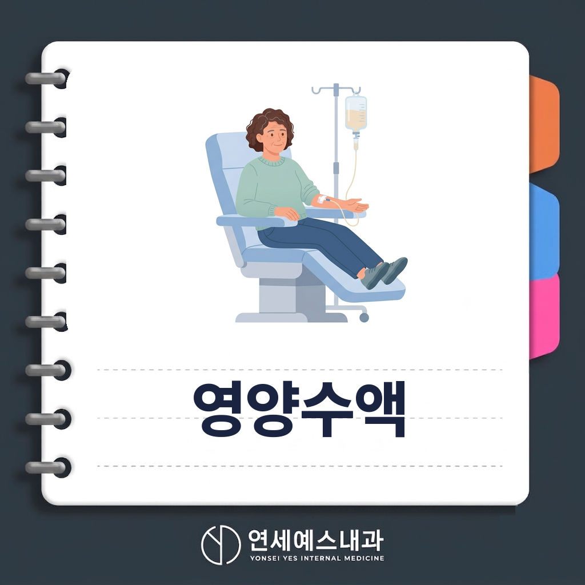
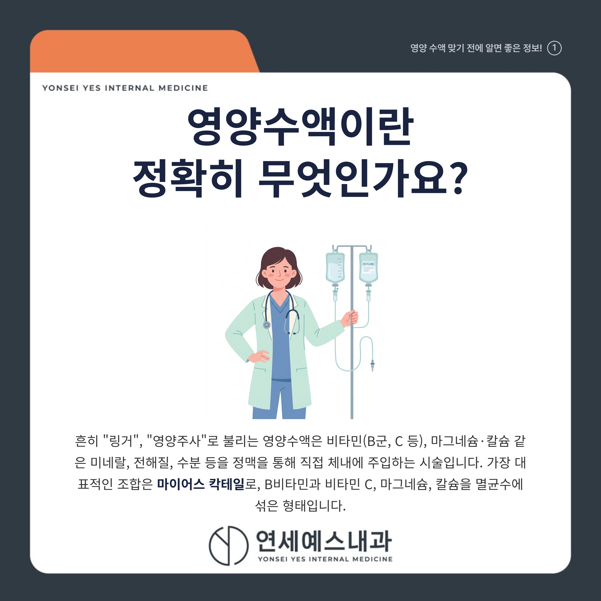
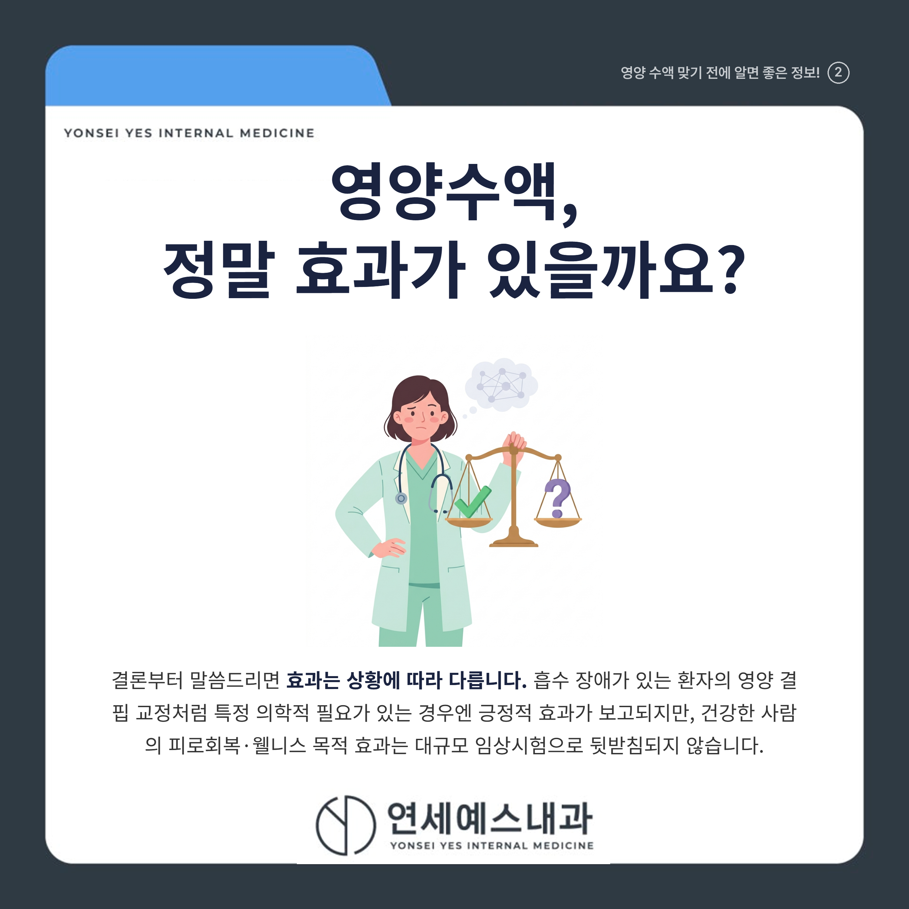
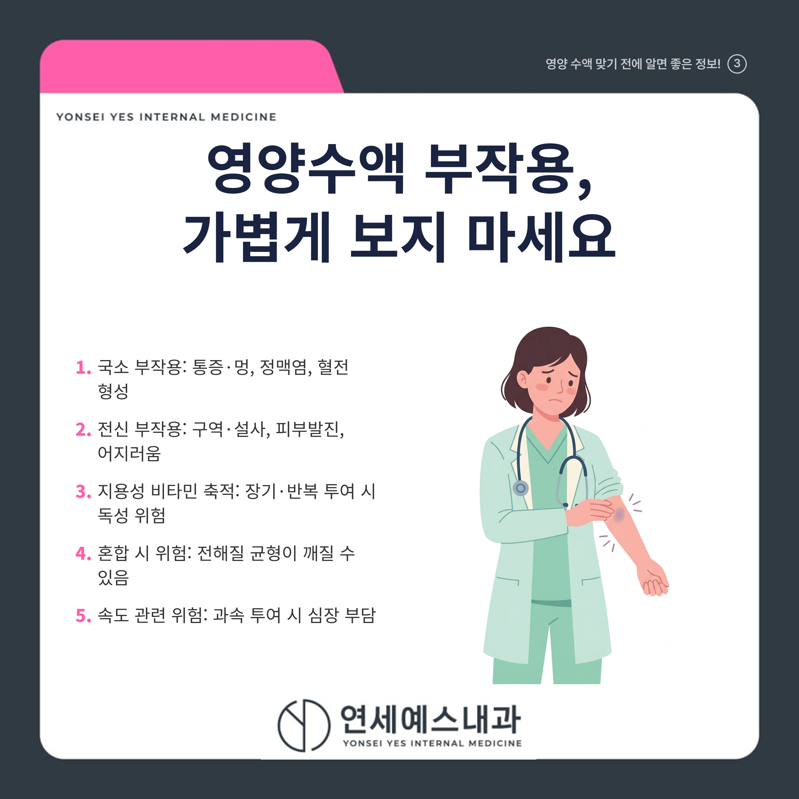
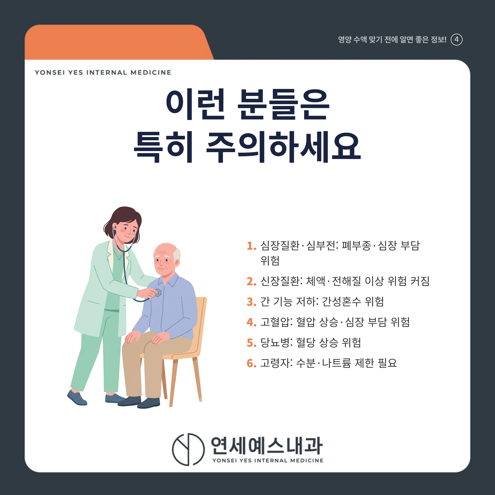
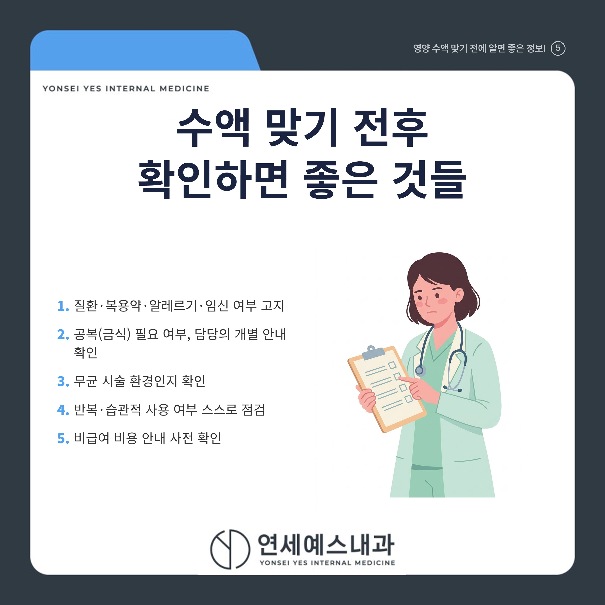
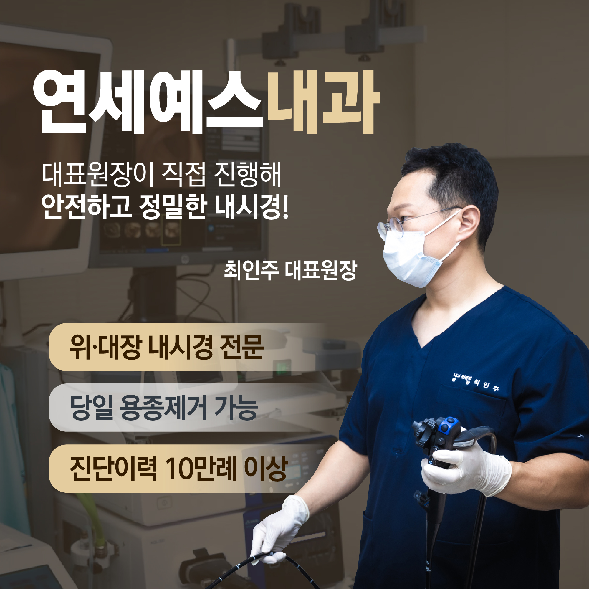
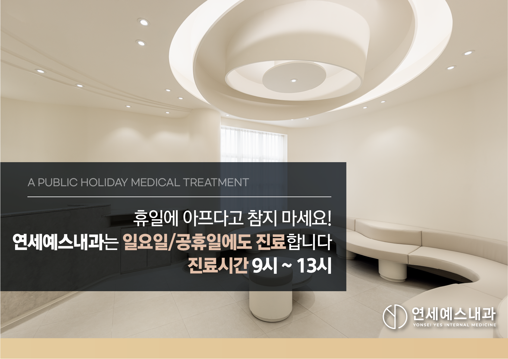
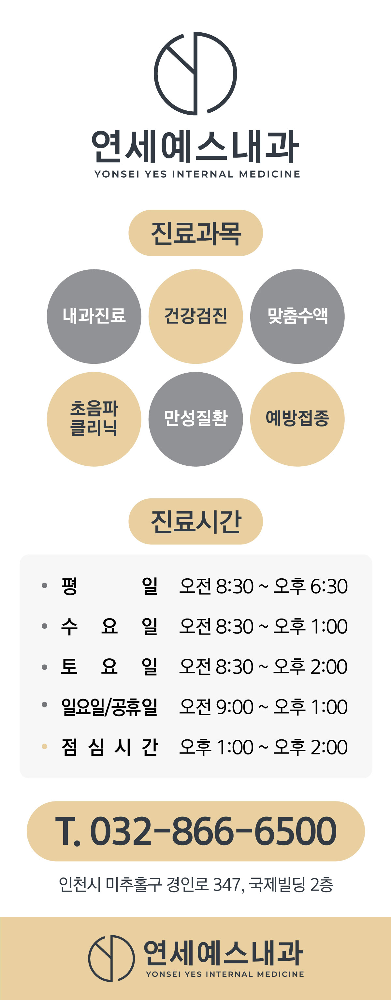
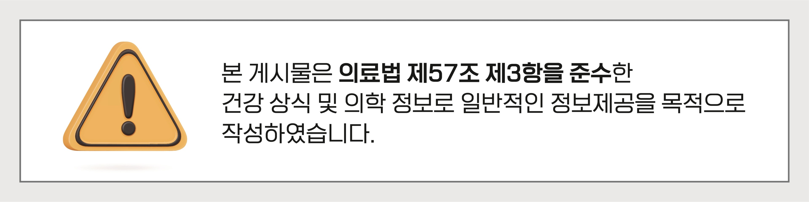

# [주안동수액내과연세예스내과] 영양수액 효과와 부작용, 꼭 알아야 할 점

안녕하세요! 여러분의 건강 주치의 연세예스내과입니다. 😊

장마철 습한 날씨에 몸이 축축 늘어지고 아침마다 유난히 피곤하시죠? 이럴 때 **영양수액** 한 대 맞고 개운하게 하루를 시작할까 고민해 보신 적, 다들 한 번쯤 있으실 겁니다. 실제로 진료실에서도 "피곤할 때마다 영양수액 맞아도 되나요?"라는 질문을 정말 많이 받습니다.

하지만 영양수액을 **"만병통치 피로회복제"**처럼 여기고 아무 정보 없이 습관적으로 맞으시는 분들이 의외로 많습니다. 오늘은 영양수액이 실제로 어떤 효과가 검증되어 있고, 어떤 점은 주의해야 하는지 정확하게 짚어보려고 합니다.

---

## 1. 🩺 영양수액이란 정확히 무엇인가요?

흔히 "링거", "영양주사"로 불리는 영양수액은 비타민(B군, C 등), 마그네슘·칼슘 같은 미네랄, 전해질, 수분 등을 정맥을 통해 직접 체내에 주입하는 시술입니다. 가장 대표적인 조합이 **"마이어스 칵테일(Myers' Cocktail)"** 인데요, 1970년대 미국 의사 존 마이어스가 고안한 것으로, B비타민과 비타민 C, 마그네슘, 칼슘을 멸균수에 섞은 형태입니다.

국내에서 통용되는 영양수액은 이 마이어스 칵테일 계열 외에도 종합비타민 수액, 아미노산 수액 등 다양한 조합으로 처방되며, **명칭이 통일되어 있지 않다**는 점이 특징입니다. 그래서 "무슨 성분이 들어가는지"를 정확히 확인하는 것이 중요합니다.

정맥으로 바로 주입하면 위장관 흡수 과정을 거치지 않기 때문에 이론적으로 생체이용률이 거의 100%에 이른다고 설명되곤 합니다. 다만 이는 **"흡수 장애가 있는 환자"**에게 특히 의미가 있는 특성이지, 건강한 사람에게 동일한 임상적 이득을 보장하는 것은 아니라는 점을 기억해 두셔야 합니다.

---

## 2. 💊 영양수액, 정말 효과가 있을까요?

**"바쁘고 피곤한 나에게 링거 한 대면 컨디션이 확 살아나겠지"** — 많은 분들이 이렇게 기대하시는데요, 결론부터 말씀드리면 **효과는 상황에 따라 다릅니다.**

근거가 비교적 확인된 경우는 따로 있습니다. 흡수 장애가 있는 환자의 영양 결핍 교정, 수술 후 회복기나 만성질환자의 신속한 영양 공급처럼 **"특정 의학적 필요가 있는 경우"**에는 긍정적인 임상 효과가 보고됩니다. 고용량 비타민 C 투여가 면역 기능 관련 지표에 영향을 줄 수 있다는 연구도 있지만, 이는 중증 감염 등 특정 임상 상황에 대한 연구일 뿐, 일반적인 "피로 해소·컨디션 관리" 목적과는 다른 맥락이라는 점이 중요합니다.

반면 근거가 부족한 부분도 분명히 있습니다. 건강한 사람을 대상으로 한 에너지 증진, 피부 개선, 피로 해소 같은 이른바 "웰니스" 목적의 효과는 대규모 무작위 대조 임상시험으로 뒷받침되지 않습니다. 마이어스 칵테일 자체도 비타민·미네랄 결핍이 없는 사람에게 효과를 검증한 연구가 매우 적고, 소수의 대조 연구에서는 오히려 치료군과 위약군 모두에서 증상이 개선되어 **치료군의 통계적 우위를 확인하지 못한 사례**도 있습니다.

실제로 미국 연방거래위원회(FTC)는 2018년 마이어스 칵테일류 제품을 암·당뇨 등 질환 치료 효능이 있다고 광고한 마케팅 업체를 "허위 및 입증되지 않은 건강 주장"으로 제재하기도 했습니다. 국내 전문가들 역시 **"영양주사 효과는 길어야 하루 이틀에 불과한 일시적 효과"**라고 지적하며, 미용·피로회복 효과를 뒷받침하는 논문은 없다고 언급합니다.

---

## 3. ⚠️ 영양수액 부작용, 가볍게 보지 마세요

**"그냥 비타민 맞는 건데 부작용이 있겠어?"**라고 생각하기 쉽지만, 영양수액도 엄연한 정맥 주입 시술인 만큼 다양한 부작용이 보고되고 있습니다.

- **국소 부작용**: 주사 부위 통증·멍, 정맥염(혈관 염증), 혈전 형성, 혈관 밖으로 약물이 새는 침윤(혈관외 유출) 시 조직 손상 위험
- **전신 부작용**: 구역, 설사 등 소화기 증상과 피부발진, 어지러움, 심장박동 증가
- **지용성 비타민 축적 문제**: 비타민 A, D, E, K는 수용성 비타민과 달리 체내에 축적되는 특성이 있어, 장기간·반복 투여 시 독성을 유발할 수 있습니다
- **여러 성분 혼합 시 위험**: 여러 물질을 한 번에 정맥으로 주입하는 "칵테일" 방식은 체내 전해질 균형을 깨뜨려 심각한 문제를 유발할 수 있습니다
- **투여 속도 관련 위험**: 적정 속도보다 느리면 효과가 반감되고, 너무 빠르게 투여되면 심장에 무리가 갈 수 있는 치명적 부작용으로 이어질 수 있습니다

특히 **2025년 발표된 증례 보고**에 따르면, 33세 여성이 글루타치온·비타민C·비타민D가 포함된 정맥 비타민 수액을 맞은 뒤 스티븐스-존슨 증후군(중증 피부·점막 박리 질환)이 발생한 사례가 있었습니다. 연구진은 규제가 느슨한 정맥 수액·웰니스 클리닉에서 이런 심각한 위험이 발생할 수 있다며, 시술 전 과거 수액 이력을 반드시 확인해야 한다고 강조했습니다. 무균 조작이 지켜지지 않을 경우 카테터 관련 혈류감염 등 **감염 위험**도 함께 존재한다는 점, 절대 가볍게 넘기지 마세요.

---

## 4. 🚨 이런 분들은 영양수액 특히 주의하세요

영양수액이 누구에게나 똑같이 안전한 것은 아닙니다. 특히 아래 기저질환이 있으신 분들은 신중하게 접근하셔야 합니다.

| 기저질환 | 주의해야 하는 이유 |
|---------|------------------|
| 심장질환·심부전 | 수분이 다량 들어가면 혈관 내 용적이 늘어 폐에 물이 차거나(폐부종) 심장에 부담을 줄 수 있음 |
| 신장질환(신부전) | 배설 기능 저하로 수분·전해질을 원활히 처리하지 못해 체액 과잉·전해질 이상 위험 커짐 |
| 간 기능 저하 | 체내 대사가 원활하지 않아 간성혼수를 일으킬 수 있다는 지적 |
| 고혈압 | 수분이 빠르게 들어가면 혈압이 오르거나 심장 부담이 커질 수 있음 |
| 당뇨병 | 포도당이 포함된 수액은 혈당을 상승시킬 수 있음 |
| 고령자 | 심장·신장 기능이 저하되어 있을 가능성이 높아 수분·나트륨 섭취 제한 필요 |

**"나는 원래 튼튼하니까 괜찮겠지"**라고 생각하시는 분들도 많지만, 위 표에 해당되는 기저질환이 있다면 반드시 시술 전 의료진에게 알리고 상담받으셔야 합니다.

---

## Q. 영양수액, 매번 피곤할 때마다 맞아도 되나요?

**아니요, 반복적·습관적으로 맞는 것은 권장되지 않습니다.** 전문가들은 영양수액의 효과가 일시적(수 시간~하루 이틀)이라는 점에서, 근본적인 해결책으로 균형 잡힌 식사와 충분한 휴식 등 생활습관 개선을 권고하며 반복적 의존은 지양할 것을 권합니다.

피로가 계속 반복된다면 단순히 수액으로 넘길 것이 아니라, 그 원인이 무엇인지 확인하는 것이 우선입니다. **"이러다 말겠지"**하고 넘기기보다, 반복되는 피로 자체를 원인부터 점검해보는 습관이 필요합니다.

---

## 5. 💉 수액 맞기 전후 확인하면 좋은 것들

영양수액을 고려하고 계시다면 아래 사항들을 미리 점검해 보시기 바랍니다.

- [ ] 현재 앓고 있는 질환, 복용 중인 약물, 알레르기 병력, 임신 여부를 의료진에게 정확히 고지했는가
- [ ] 일반적인 영양수액은 공복(금식)이 필수 조건은 아니지만, 담당 의료진의 개별 안내를 확인했는가
- [ ] 시술 기관이 무균 조작이 지켜지는 환경인지 확인했는가
- [ ] 반복적·습관적으로 맞고 있지는 않은지 스스로 점검했는가
- [ ] 비급여 항목 관련 비용 안내를 미리 확인했는가

특히 비용 관련해서는 참고하실 점이 있습니다. 국내에서 영양수액은 대부분 비급여 항목이며, 식약처 허가 범위 밖으로 사용된 경우 치료 목적 부합성이 인정되지 않아 실손의료보험금 지급이 거절될 수 있다는 점이 보험업계·의료계에서 지적되어 왔습니다. 2026년부터 시행되는 5세대 실손보험에서는 비급여 주사제가 "비중증" 항목으로 분류되어 보장 한도(연 1,000만원)와 자기부담률(50%)이 강화되었습니다. 의학적 근거·부작용과는 별개의 제도적 정보이지만, 시술 전 비용 관련 의사결정에 참고하시면 좋습니다.

---

## ✅ 영양수액, 이것만은 꼭 기억하세요

| 항목 | 핵심 행동 |
|------|----------|
| 효과 | 결핍·특정 질환자에게는 의미 있으나, 건강한 사람의 웰니스 효과는 근거 불충분 |
| 부작용 | 정맥염·혈전·전해질 불균형·드물게 중증 피부질환까지 가능 |
| 기저질환 | 심장·신장·간질환, 고혈압, 당뇨, 고령자는 특히 신중하게 |
| 습관적 사용 | 일시적 효과이므로 반복 의존보다 생활습관 개선이 우선 |
| 시술 전 | 병력·복용약·알레르기 정보를 의료진에게 반드시 고지 |

> **"영양수액은 만능이 아니라, 필요한 사람에게 필요한 만큼 쓰일 때 의미가 있습니다."**

혹시 최근 계속되는 피로감으로 영양수액을 고려하고 계셨다면, 무작정 맞기보다 내 몸 상태에 정말 필요한 시술인지부터 확인하는 것이 우선입니다. 기저질환이 있으시거나 처음 시술을 고려하신다면, **가까운 내과에 편안하게 걸음 하셔서** 전문의와 충분히 상담해 보시기 바랍니다.

---

※ 모든 치료 및 예방접종은 개인의 상태에 따라 발열, 통증, 알레르기 반응 등의 부작용이 나타날 수 있으므로, 반드시 의료진과 충분한 상담 후 진행하시기 바랍니다.

연세예스내과에서 전해드리는 건강 정보였습니다. 오늘도 건강하고 평안한 하루 보내세요!

---

#영양수액 #마이어스칵테일 #영양주사 #주안동내과 #주안동의원 #주안동내과의원 #주안내과 #주안의원 #주안내과의원 #주안역내과
