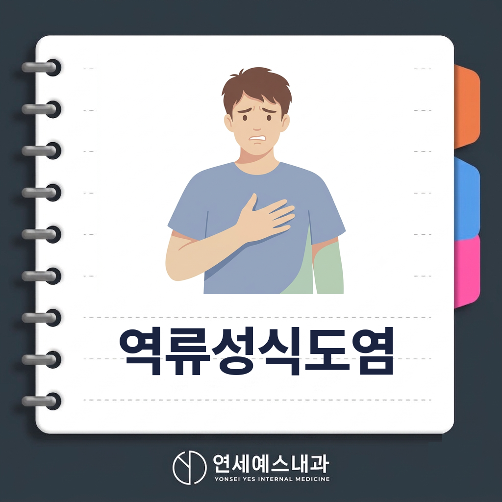
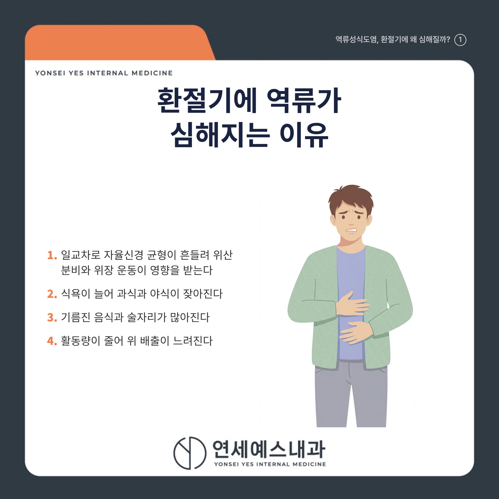
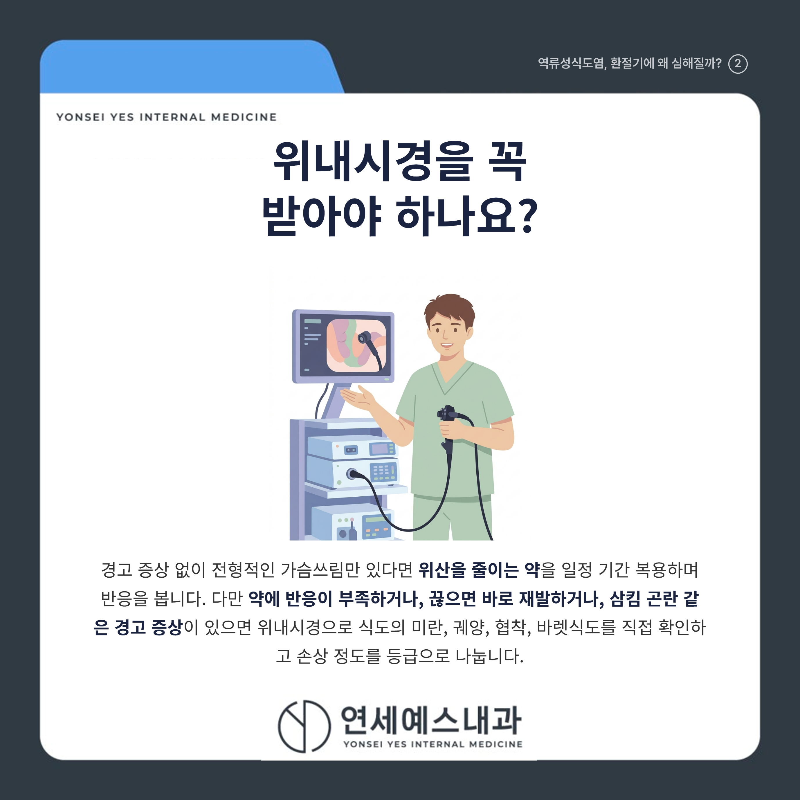
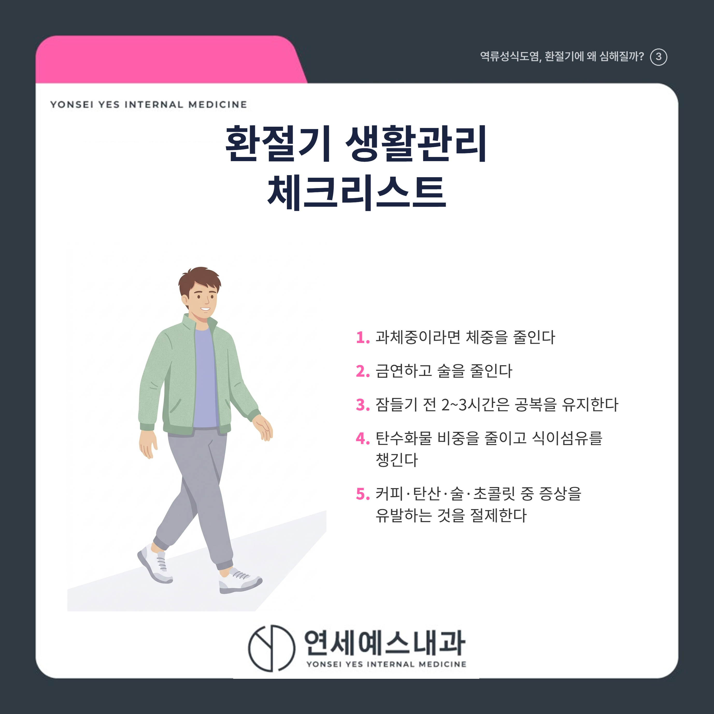
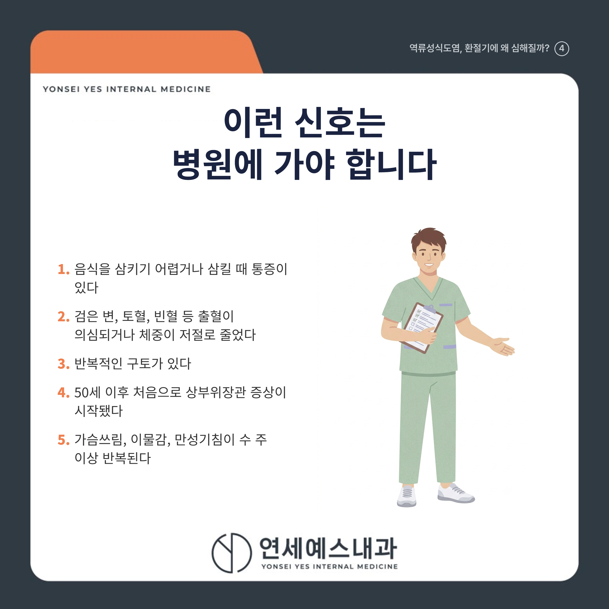

# 역류성식도염 증상과 생활관리 | 주안동 내과

안녕하세요! 여러분의 건강 주치의 연세예스내과입니다. 😊

아침저녁으로 공기가 쌀쌀해지고 식욕이 도는 요즘, 역류성식도염으로 속이 불편하다는 분들이 부쩍 늘었습니다.

"에이, 매년 이맘때면 좀 쓰리지" 하며 신물이 올라와도 그냥 넘기시는 분들 많으시죠?

하지만 환절기에는 증상이 잦아지기 쉽습니다. 결론부터 말씀드리면, 가을에 역류성식도염이 느는 이유는 일교차로 자율신경 균형이 흔들리는 데다, 식욕이 늘어 과식·야식·기름진 음식·술자리가 함께 많아지기 때문입니다.

관리의 출발점은 약이 아니라 생활습관입니다. 과체중이라면 체중을 줄이고, 잠들기 전 2~3시간은 공복을 유지하는 것이 먼저입니다. 다만 삼킴 곤란이나 체중 감소 같은 경고 신호가 있다면 미루지 말고 위내시경을 받아야 합니다.

아래에서 악화 이유, 증상, 진단, 생활관리, 병원에 가야 하는 신호를 하나씩 살펴보겠습니다.

---

## 1. 🌡️ 환절기에 역류성식도염이 심해지는 이유

역류성식도염은 위산이 식도로 거꾸로 올라와 식도 점막에 염증을 일으키는 상태입니다.

위식도역류질환은 **가을에서 초겨울(10~12월)에 발생이 가장 많다**는 역학 연구 결과가 있습니다.

일교차가 커지면 체온 유지 부담이 늘어 자율신경(몸을 자동으로 조절하는 신경) 균형이 흔들리고, 위산 분비와 위장 운동도 영향을 받습니다.

여기에 식욕이 늘어 과식·야식이 잦아지고, 기름진 음식과 술자리가 많아지며, 활동량이 줄어 위 배출도 느려집니다.

---

## 2. 🔥 이런 증상이 있다면 역류를 의심하세요

가장 흔한 증상은 가슴 한가운데가 타는 듯한 **가슴쓰림**과 신물이 목까지 올라오는 **위산역류**입니다.

다음처럼 '식도 밖' 증상으로 나타나기도 합니다.

[   ] 목에 무언가 걸린 듯한 이물감이 있다

[   ] 아침에 목이 쉬거나 마른기침이 몇 주째 계속된다

[   ] 삼킬 때 불편하거나 협심증처럼 가슴이 아프다

증상만으로는 다른 질환과 구분이 어려워, 언제 얼마나 자주 생기는지 함께 살펴야 합니다.

---

## Q. 역류성식도염, 위내시경을 꼭 받아야 하나요?

경고 증상 없이 전형적인 가슴쓰림만 있다면, 보통 위산을 줄이는 약을 일정 기간 복용하며 반응을 봅니다.

다만 **약에 반응이 부족하거나, 끊으면 바로 재발하거나, 삼킴 곤란 같은 경고 증상이 있으면 위내시경**이 필요합니다.

위내시경은 식도의 미란(점막이 헐어 벗겨진 상태), 궤양, 협착, 바렛식도를 직접 확인하고 손상 정도를 등급으로 나눕니다.

내시경이 정상인데 증상이 계속되면 24시간 식도 산도 검사 등을 추가로 고려합니다.

---

## 3. 🥗 환절기 생활관리 체크리스트

근거가 비교적 뚜렷한 관리법부터 실천해 보세요.

[   ] 과체중이라면 체중 감량 (역류 증상 개선 근거가 뚜렷합니다)

[   ] 금연과 절주 (위와 식도 사이를 닫는 하부식도괄약근의 압력을 낮춥니다)

[   ] 잠들기 전 2~3시간은 공복 유지, 야식과 과식 피하기

[   ] 탄수화물 비중을 줄이고 식이섬유 챙기기

[   ] 커피, 탄산, 술, 초콜릿 중 본인 증상을 유발하는 것 위주로 절제

> 💡 환절기 팁
> 회식이 늘어나는 시기입니다. 식후 바로 눕지 않기, 가벼운 산책만 지켜도 야간 역류를 줄이는 데 도움이 됩니다.

> ⚠️ 생활관리만으로는 부족할 수 있습니다
> 생활습관 개선만으로 완치되지는 않으며, 증상이 이어지면 약물치료를 함께 진행해야 합니다.

---

## 4. 🚨 역류성식도염, 언제 병원에 가야 하나요

다음은 단순한 속쓰림이 아니라 정밀 검사가 필요한 신호입니다.

[   ] ==음식을 삼키기 어렵거나 삼킬 때 통증이 있다==

[   ] ==검은 변, 토혈, 빈혈 등 출혈이 의심되거나 체중이 저절로 줄었다==

[   ] 반복적인 구토가 있다

[   ] 50세 이후 처음으로 상부위장관 증상이 시작됐다

[   ] 가슴쓰림, 이물감, 만성기침이 수 주 이상 반복된다

하나라도 해당되면 미루지 말고 가까운 내과에서 전문의와 상담해 보세요.

---

## ✅ 환절기 속쓰림 한눈 요약

| 항목 | 핵심 내용 |
|------|----------|
| 악화 이유 | 과식·야식·고지방식, 활동량 감소, 자율신경 변화 |
| 대표 증상 | 가슴쓰림, 위산역류, 이물감, 만성기침 |
| 진단 | 약물 반응 확인 후 필요 시 위내시경 |
| 생활관리 | 체중 감량, 금연·절주, 식후 2~3시간 눕지 않기 |
| 경고 신호 | 삼킴 곤란, 체중 감소, 출혈 징후, 반복 구토 |

> "속이 자주 쓰리다면, 참기보다 내 식습관과 몸을 먼저 살펴볼 때입니다."

역류성식도염 증상이 반복되거나 심해진다면 미루지 마시고 근처 내과에서 상태에 맞는 검사와 관리 방향을 확인해 보세요.

---

※ 모든 치료 및 예방접종은 개인의 상태에 따라 발열, 통증, 알레르기 반응 등의 부작용이 나타날 수 있으므로, 반드시 의료진과 충분한 상담 후 진행하시기 바랍니다.

연세예스내과에서 전해드리는 건강 정보였습니다. 오늘도 건강하고 평안한 하루 보내세요!

---

#역류성식도염 #위산역류 #가슴쓰림 #석바위내과의원 #위내시경 #대장내시경 #검진 #주안동내과 #주안동의원 #주안동내과의원
