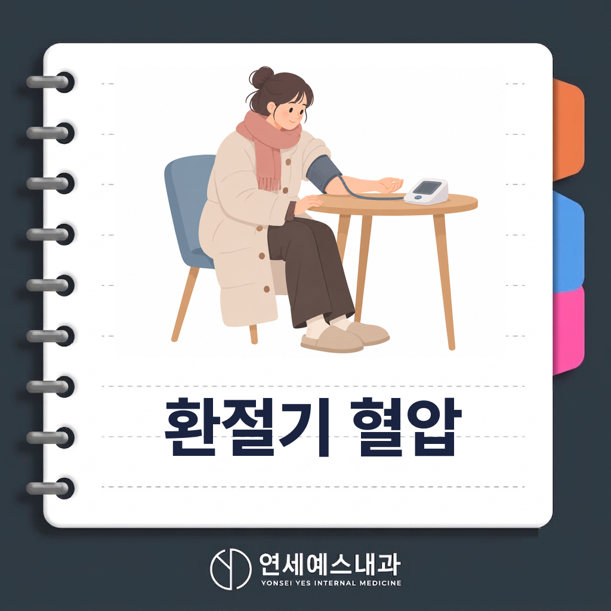
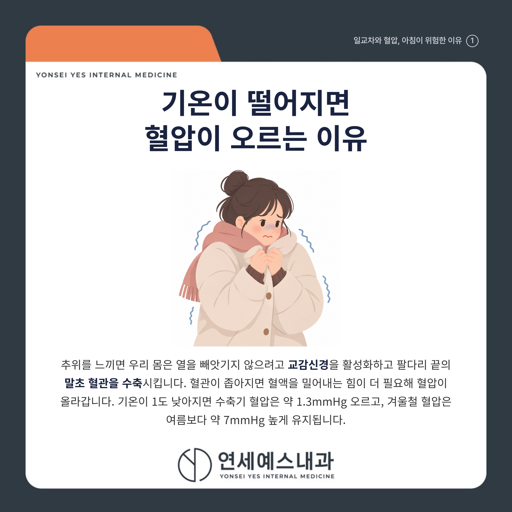
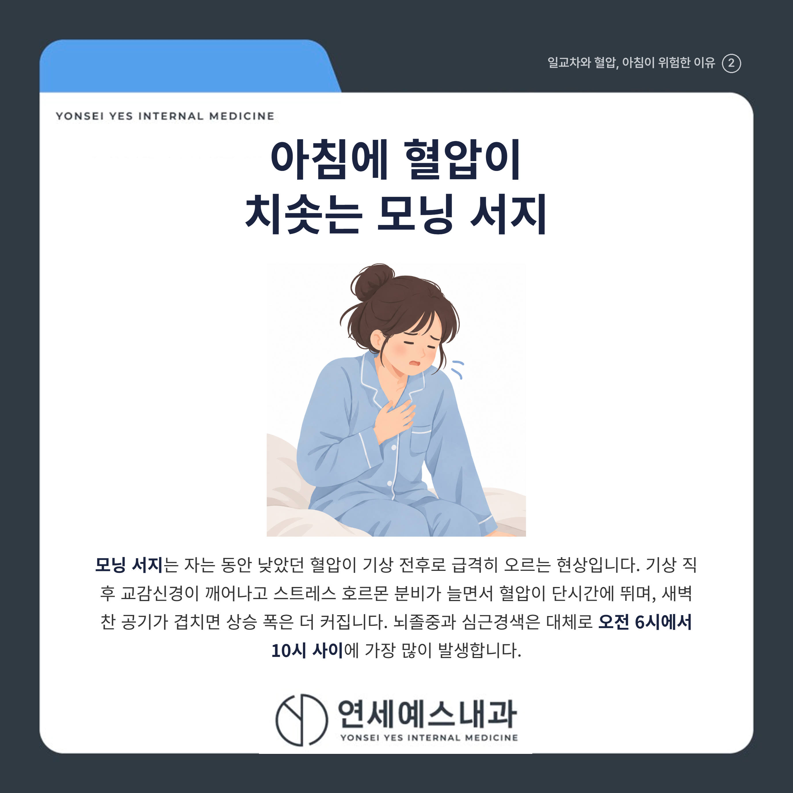
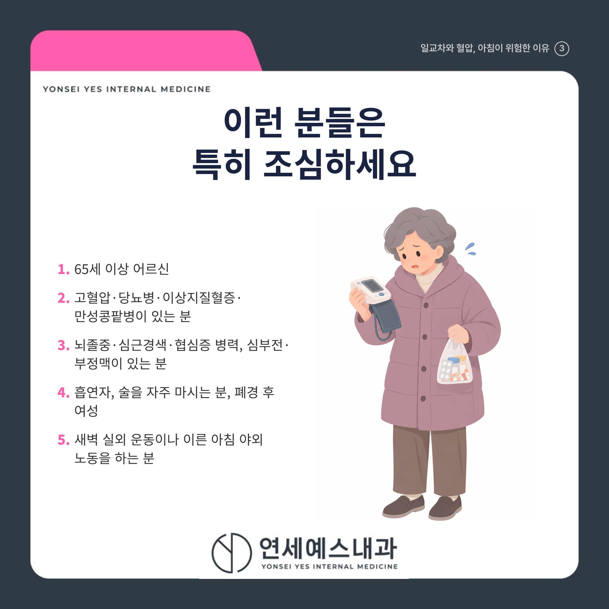
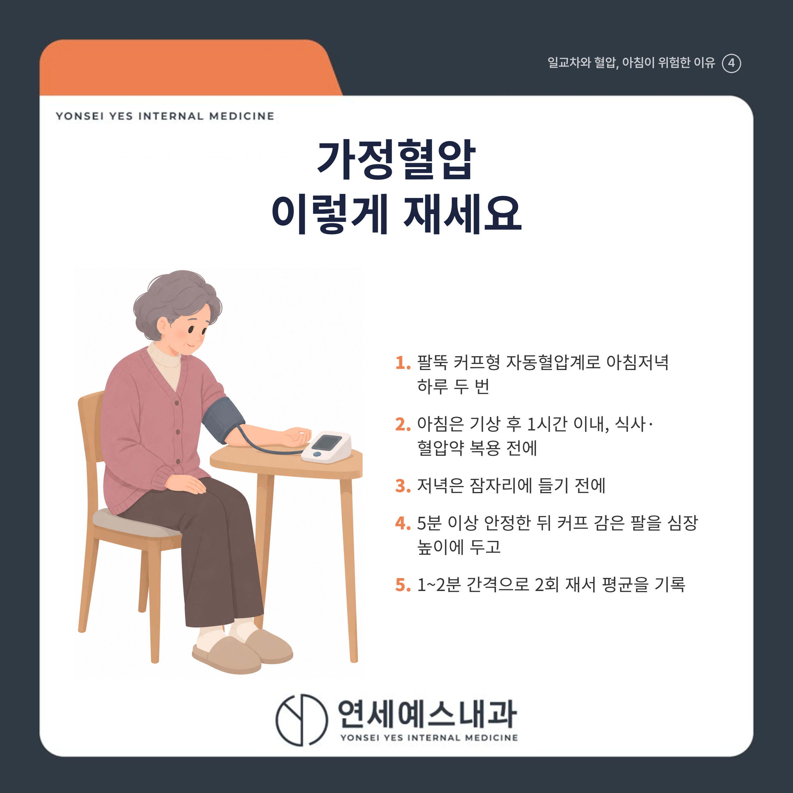

# 일교차 클수록 혈압이 위험한 이유는?

안녕하세요! 여러분의 건강 주치의 연세예스내과입니다. 😊

아침저녁으로 공기가 부쩍 쌀쌀해지고, 낮과의 기온 차가 10도 넘게 벌어지는 날이 많아졌습니다.

"혈압약만 잘 먹으면 괜찮겠지" 하며 집에서 혈압을 재보지 않는 분들 많으시죠? 하지만 환절기에는 같은 사람도 하루에 몇 번씩 혈압이 출렁입니다.

결론부터 말씀드리면, 기온이 떨어지면 혈관이 수축해 혈압이 오르고, 낮과 밤의 기온 차가 큰 환절기에는 이 오르내림이 하루에도 여러 번 반복돼 심장과 뇌에 부담을 줍니다.

특히 잠에서 깬 직후 2~3시간은 혈압이 가장 가파르게 치솟는 시간대라, 이불 속에서 스트레칭한 뒤 천천히 일어나고 찬 공기에 갑자기 노출되지 않는 것이 중요합니다. 아래에서 그 이유와 가정혈압 재는 법, 병원에 가야 할 신호를 하나씩 짚어 드리겠습니다.

---

## 1. 🌡️ 기온이 떨어지면 혈압이 오르는 이유

추위를 느끼면 우리 몸은 열을 빼앗기지 않으려고 **교감신경**을 활성화하고, 팔다리 끝의 **말초 혈관을 수축**시킵니다.

혈관이 좁아지면 혈액을 밀어내는 힘이 더 필요해 혈압이 올라갑니다. 기온이 1도 낮아질 때 수축기 혈압은 약 1.3mmHg 오르고, 겨울철 혈압은 여름보다 수축기 기준 약 7mmHg 높게 유지되는 것으로 인용됩니다.

추위는 혈액을 끈끈하게 만들어 혈전(피떡)이 생기기 쉬운 환경도 만듭니다. ==기온이 1도 내려갈 때마다 심뇌혈관질환 사망 위험은 약 1.6% 높아진다==는 추정도 있습니다.

---

## 2. ⏰ 아침 혈압이 갑자기 치솟는 모닝 서지

**모닝 서지(morning surge)**란 자는 동안 낮았던 혈압이 기상 전후로 급격히 오르는 현상을 말합니다.

기상 직후 교감신경이 깨어나고 스트레스 호르몬 분비가 늘면서 혈압이 단시간에 뜁니다. 여기에 새벽 찬 공기가 겹치면 상승 폭은 더 커집니다.

과도한 모닝 서지는 24시간 평균 혈압과 상관없이 뇌졸중 위험을 높입니다. 수면 중 최저치 대비 아침 상승 폭이 10mmHg 커지면 뇌졸중 위험이 약 22% 늘었다는 연구도 있습니다.

> ⚠️ 기상 직후를 조심하세요
> 뇌졸중과 심근경색은 대체로 오전 6시에서 10시 사이에 가장 많이 발생합니다. 잠에서 깨면 이불 속에서 가볍게 스트레칭한 뒤 천천히 일어나고, 찬물 세수나 급한 외출, 배변 시 과도하게 힘주는 행동은 피하세요.

---

## 3. ❤️ 이런 분들은 특히 조심하세요

일교차에 따른 혈압 변동과 심뇌혈관 위험이 특히 큰 분들입니다.

[   ] 65세 이상 어르신

[   ] 고혈압, 당뇨병, 이상지질혈증(고지혈증), 만성콩팥병이 있는 분

[   ] 뇌졸중, 심근경색, 협심증 병력이 있거나 심부전, 부정맥이 있는 분

[   ] 흡연자, 술을 자주 마시는 분, 폐경 후 여성

[   ] 새벽에 실외 운동을 하거나 이른 아침 야외에서 오래 일하는 분

해당되는 항목이 있다면 환절기에는 가정혈압을 더 자주 확인하고, 무리한 새벽 활동을 줄이는 것이 좋습니다.

---

## Q. 가정혈압, 어떻게 재야 정확할까요?

팔뚝(상완) 커프형 자동혈압계로 아침저녁 하루 두 번 재는 것이 기본입니다. 집에서 잰 평균이 135/85mmHg 이상이면 고혈압으로 봅니다.

아침에는 기상 후 1시간 이내에 소변을 본 뒤, 아침 식사와 혈압약 복용 전에 재고, 저녁에는 잠자리에 들기 전에 잽니다.

등받이 의자에 5분 이상 앉아 안정한 뒤, 다리를 꼬지 않고 커프 감은 팔을 심장 높이에 둡니다. 1~2분 간격으로 2회 재서 평균을 기록하세요.

> 💡 한 번보다 꾸준한 기록이 중요합니다
> 특정 날의 높은 값 하나보다 여러 날 평균과 추세가 더 중요합니다. 날짜와 시각, 모든 값을 적어 두었다가 진료 때 가져가면 약 조정에 큰 도움이 됩니다.

---

## 🚑 언제 병원에 가야 하나

아래 증상은 뇌졸중이나 심근경색의 조기 신호일 수 있습니다. 하나라도 갑자기 나타나면 ==시간을 지체하지 말고 즉시 119에 연락하세요.== 증상이 잠깐 나타났다 사라져도 반드시 진료를 받아야 합니다.

[   ] 한쪽 팔다리에 힘이 빠지거나 마비되고, 얼굴 한쪽이 처진다

[   ] 갑자기 말이 어눌해지거나 상대의 말을 이해하지 못한다

[   ] 한쪽 눈이 안 보이거나 시야가 좁아지고, 극심한 두통과 어지럼증이 생긴다

[   ] 가슴 한가운데를 쥐어짜는 듯한 통증이 턱, 목, 왼팔, 등으로 퍼진다

[   ] 식은땀, 호흡곤란이 가슴 통증과 함께 나타난다

심근경색과 뇌졸중은 발병 후 처음 몇 시간의 대응이 예후를 좌우합니다. "조금 쉬면 낫겠지" 하고 기다리지 마세요.

---

## ✅ 환절기 혈압 관리 생활수칙

| 상황 | 핵심 행동 |
|------|----------|
| 외출 | 옷을 여러 겹 입고 모자, 목도리, 장갑으로 보온 |
| 운동 | 이른 새벽 대신 해가 뜬 낮 시간에, 준비운동 충분히 |
| 기상 | 이불 속 스트레칭 후 천천히 일어나기 |
| 실내 | 적정 온도로 난방하고 실내외 온도 차 줄이기 |
| 수분 | 따뜻한 물을 자주 마셔 탈수 예방 |
| 약 | 겨울에 혈압이 올라도 임의로 중단, 감량하지 말고 진료받기 |

혈압약은 계절에 따라 용량 조정이 필요할 수 있으니, 아침 혈압이 높거나 변동이 크면 가정혈압 기록을 들고 진료받아 보세요.

> "오늘 아침 재본 혈압 한 줄이 겨울철 뇌졸중을 막는 첫걸음입니다."

일교차가 커지는 환절기에 혈압이 불안정하다면 참지 마시고, 가까운 내과에서 전문의와 상담해 보시기 바랍니다.

---

※ 모든 치료 및 예방접종은 개인의 상태에 따라 발열, 통증, 알레르기 반응 등의 부작용이 나타날 수 있으므로, 반드시 의료진과 충분한 상담 후 진행하시기 바랍니다.

연세예스내과에서 전해드리는 건강 정보였습니다. 오늘도 건강하고 평안한 하루 보내세요!

---

#일교차혈압 #모닝서지 #가정혈압측정 #주안내과 #주안의원 #주안내과의원 #주안역내과 #주안역의원 #주안역내과의원 #시민공원역내과
