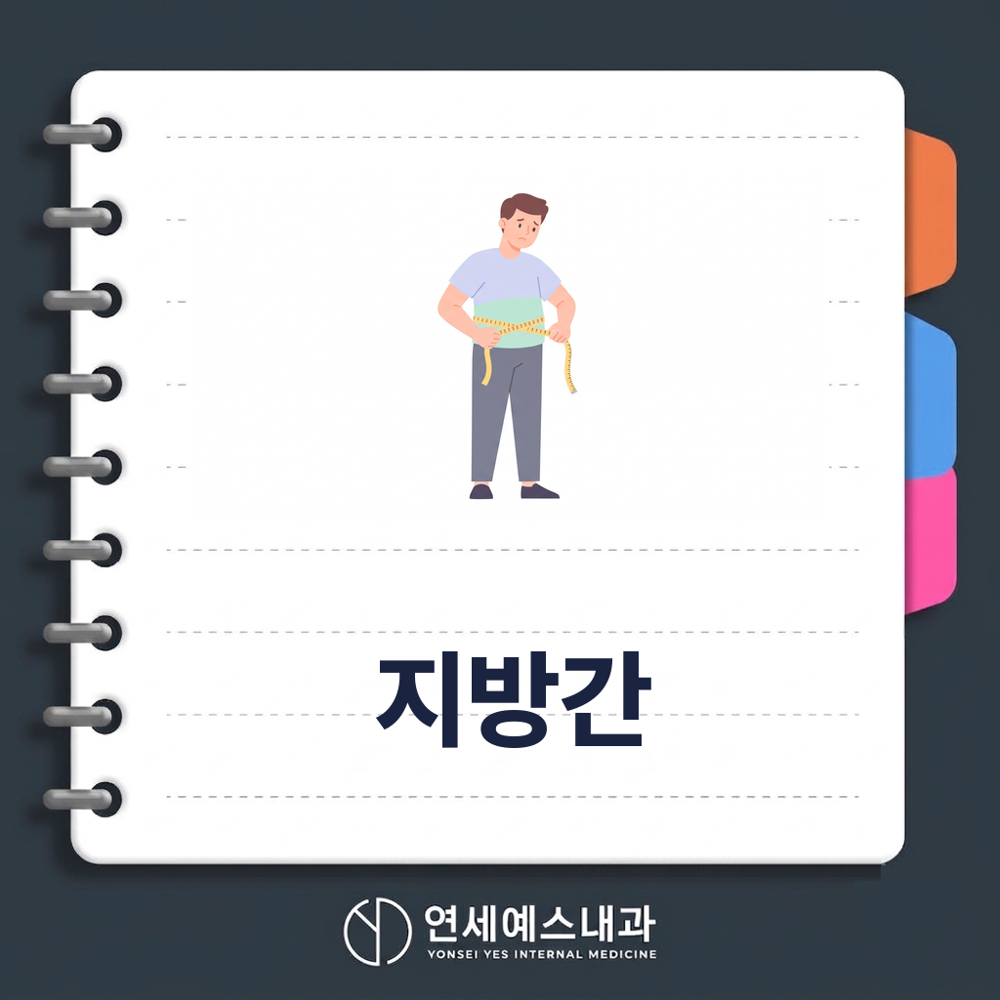
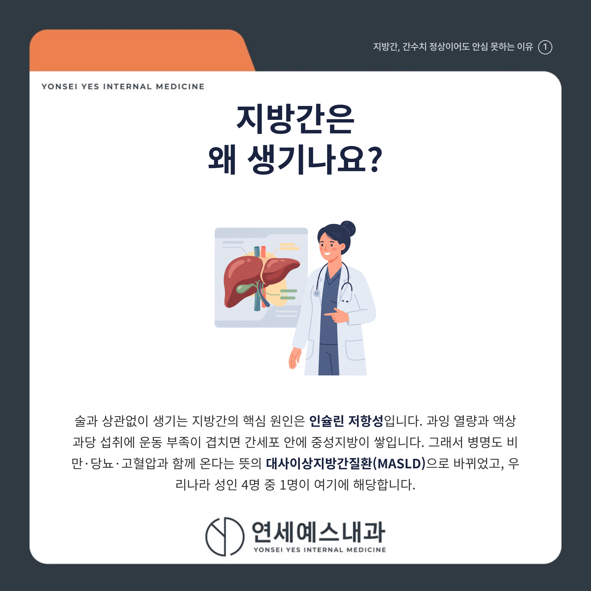
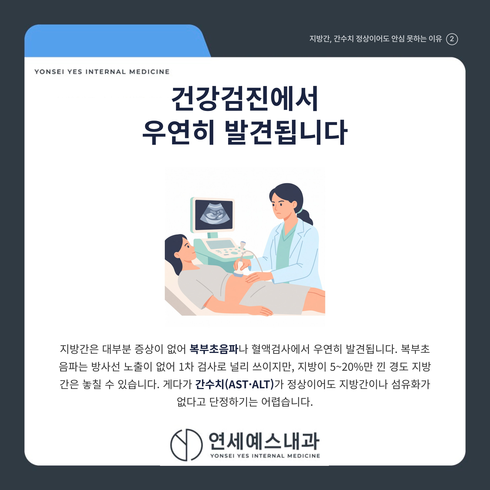
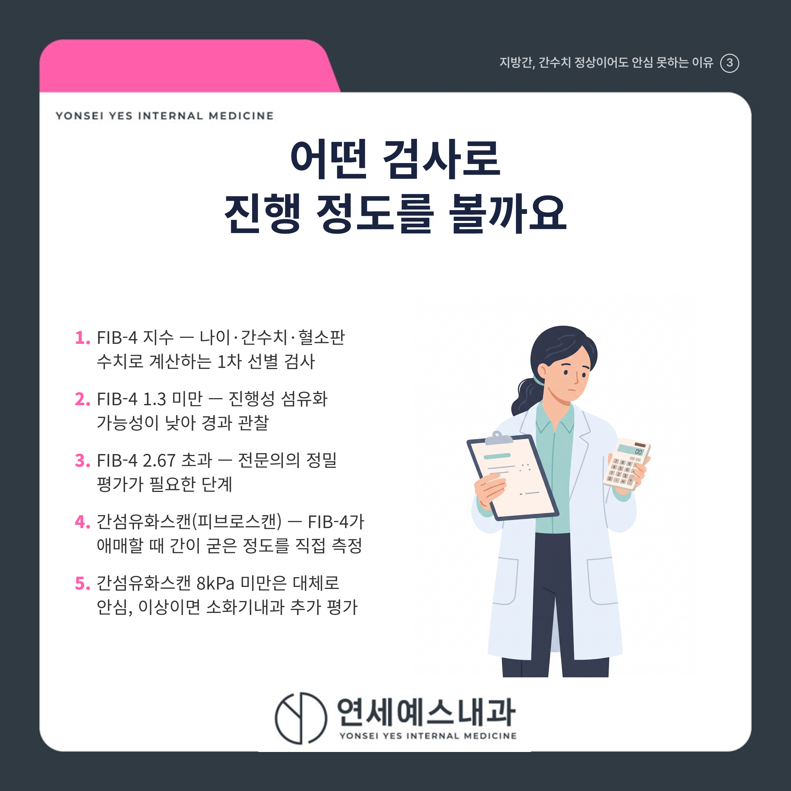
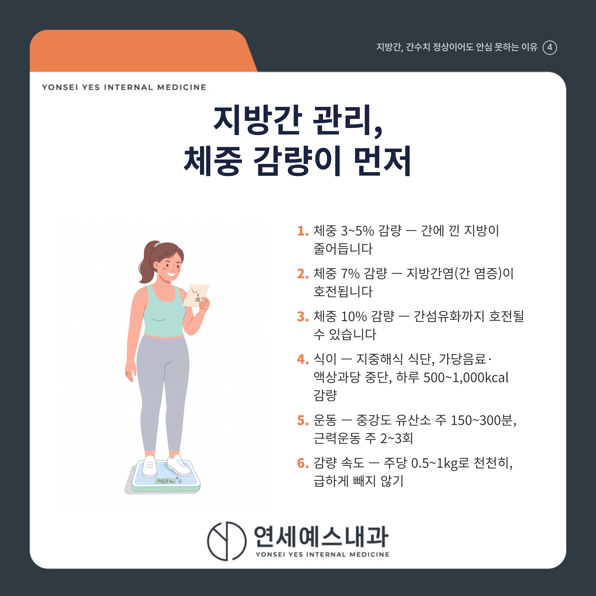

# 지방간 관리 3가지, 체중 5%부터 줄이기

안녕하세요! 여러분의 건강 주치의 연세예스내과입니다. 😊

미뤄뒀던 직장 건강검진을 하반기에 몰아서 받는 분들이 많은 요즘입니다.

결과지에서 '지방간 의심' 소견을 보고도 '술도 안 마시는데 무슨 지방간이야.' 하며 대수롭지 않게 넘기시는 분들이 많습니다.

결론부터 말씀드리면, 간수치가 정상이어도 지방간이나 간섬유화가 숨어 있을 수 있어 '수치 정상=이상 없음'으로 안심하기 어렵습니다.

그래서 복부초음파에서 지방간 소견을 받았다면 섬유화가 어느 정도 진행했는지 확인하는 것이 먼저입니다.

그리고 지방간을 되돌리는 1차 치료는 약이 아니라 체중을 3~5%부터 줄이는 생활습관 교정입니다.

---

## 1. 🩺 지방간은 왜 생기나요?

술과 상관없이 생기는 지방간의 핵심 원인은 **인슐린 저항성**(인슐린이 제 역할을 못 하는 상태)입니다.

과잉 열량과 액상과당 섭취에 운동 부족이 겹치면, 간세포 안에 중성지방이 쌓이게 됩니다.

그래서 최근에는 병명도 **대사이상지방간질환(MASLD)**으로 바뀌었습니다. 비만, 당뇨, 고혈압, 이상지질혈증 같은 대사 이상과 함께 오는 병이라는 뜻입니다.

우리나라 성인의 약 24%, 4명 중 1명이 여기에 해당합니다. 마른 체형이어도 내장지방이 많으면 생길 수 있습니다.

---

## 2. 🔍 건강검진에서 우연히 발견됩니다

지방간은 대부분 증상이 없어 **복부초음파**나 혈액검사에서 우연히 발견됩니다.

복부초음파는 방사선 노출이 없어 1차 검사로 널리 쓰이지만, 지방이 5~20%만 낀 경도 지방간은 놓칠 수 있습니다.

> ⚠️ 간수치가 정상이라도 안심은 이릅니다
> 지방간이 있어도 간수치(AST·ALT)가 정상 범위인 경우가 매우 흔하고, 간경변으로 진행한 환자도 최대 80%가량은 ALT가 정상으로 나옵니다.
> ==간수치가 정상이라고 지방간이나 섬유화가 없는 것은 아닙니다.==

---

## 3. ⚠️ 방치하면 어디까지 진행하나요?

단순 지방간은 **지방간염**(간에 염증이 생긴 단계), 간섬유화, 간경변, 간암 순으로 진행할 수 있습니다.

모든 지방간이 나빠지는 것은 아니지만, ==지금 어느 단계인지는 검사 전에는 알 수 없습니다.==

특히 **섬유화가 얼마나 진행했는지**가 앞으로의 경과를 좌우하는 핵심 지표입니다.

게다가 지방간 환자의 사망 원인 1위는 심근경색·뇌졸중 같은 심혈관질환으로, 전체 사망의 약 절반을 차지합니다.

---

## Q. 지방간, 어떤 검사로 진행 정도를 확인하나요?

혈액검사로 계산하는 **FIB-4 지수**로 먼저 선별하고, 애매하면 **간섬유화스캔(피브로스캔)**으로 간이 얼마나 굳었는지 측정합니다.

FIB-4는 나이와 간수치, 혈소판 수치로 계산합니다. 1.3 미만이면 진행성 섬유화 가능성이 낮고, 2.67을 넘으면 전문의 평가가 필요합니다.

간섬유화스캔 수치가 8kPa 미만이면 대체로 안심할 수 있고, 그 이상이면 소화기내과 전문의의 추가 평가를 권합니다.

---

## 4. 🏃 지방간 관리 핵심 3가지

비알코올성 지방간의 1차 치료는 약이 아니라 **체중 감량, 식이, 운동**입니다.

| 관리 | 핵심 목표 |
|------|----------|
| 체중 감량 | 3~5% 줄이면 간 지방 감소, 7%는 지방간염 호전, 10%는 섬유화 호전 |
| 식이 | 지중해식 식단, 가당음료·액상과당 중단, 하루 500~1,000kcal 감량 |
| 운동 | 중강도 유산소 주 150~300분과 근력운동 주 2~3회 |

체중은 급하게 빼지 말고 **주당 0.5~1kg** 정도로 천천히 줄이는 것이 좋습니다.

> 💡 체중이 그대로여도 운동은 효과가 있습니다
> 한국 성인 연구에서 체중 변화가 없어도 규칙적인 운동만으로 간 지방과 인슐린 저항성이 좋아졌습니다.

---

## ✅ 추적검사, 얼마나 자주 받아야 하나요?

[   ] 저위험군(FIB-4 1.3 미만): 1~3년마다 재평가

[   ] 중등도 위험군(FIB-4 1.3~2.67): 2~3년마다 간섬유화스캔 재평가

[   ] 진행성 섬유화·전문의 관리군: 6~12개월마다 추적

[   ] 간경변: 6개월마다 복부초음파로 간암 감시

---

## 🚑 언제 병원에 가야 하나요?

아래 중 하나라도 해당한다면 미루지 말고 가까운 내과에서 추가 검사를 받아 보시기 바랍니다.

[   ] FIB-4 지수가 2.67을 넘거나 간섬유화스캔이 8kPa 이상으로 나왔다

[   ] 건강검진 때마다 간수치(AST·ALT)가 계속 높게 나온다

[   ] 당뇨나 비만이 있으면서 복부초음파에서 중등도 이상 지방간 소견을 받았다

[   ] 갑작스러운 체중 감소, 황달, 복수 등 간기능 저하가 의심되는 증상이 있다

---

지방간은 혈당, 혈압, 콜레스테롤 관리와 함께 봐야 하는 병입니다.

> "지방간 관리는 간과 심장, 혈관을 함께 지키는 일입니다."

건강검진에서 지방간이나 간수치 이상을 확인하셨다면, 가까운 내과에서 섬유화 위험도와 대사 상태를 함께 평가받아 보시기 바랍니다.

---

※ 모든 치료 및 예방접종은 개인의 상태에 따라 발열, 통증, 알레르기 반응 등의 부작용이 나타날 수 있으므로, 반드시 의료진과 충분한 상담 후 진행하시기 바랍니다.

연세예스내과에서 전해드리는 건강 정보였습니다. 오늘도 건강하고 평안한 하루 보내세요!

---

#지방간 #비알코올성지방간 #지방간관리 #시민공원역의원 #시민공원역내과의원 #주안사거리내과 #주안사거리의원 #주안사거리내과의원 #미추홀내과 #미추홀의원
