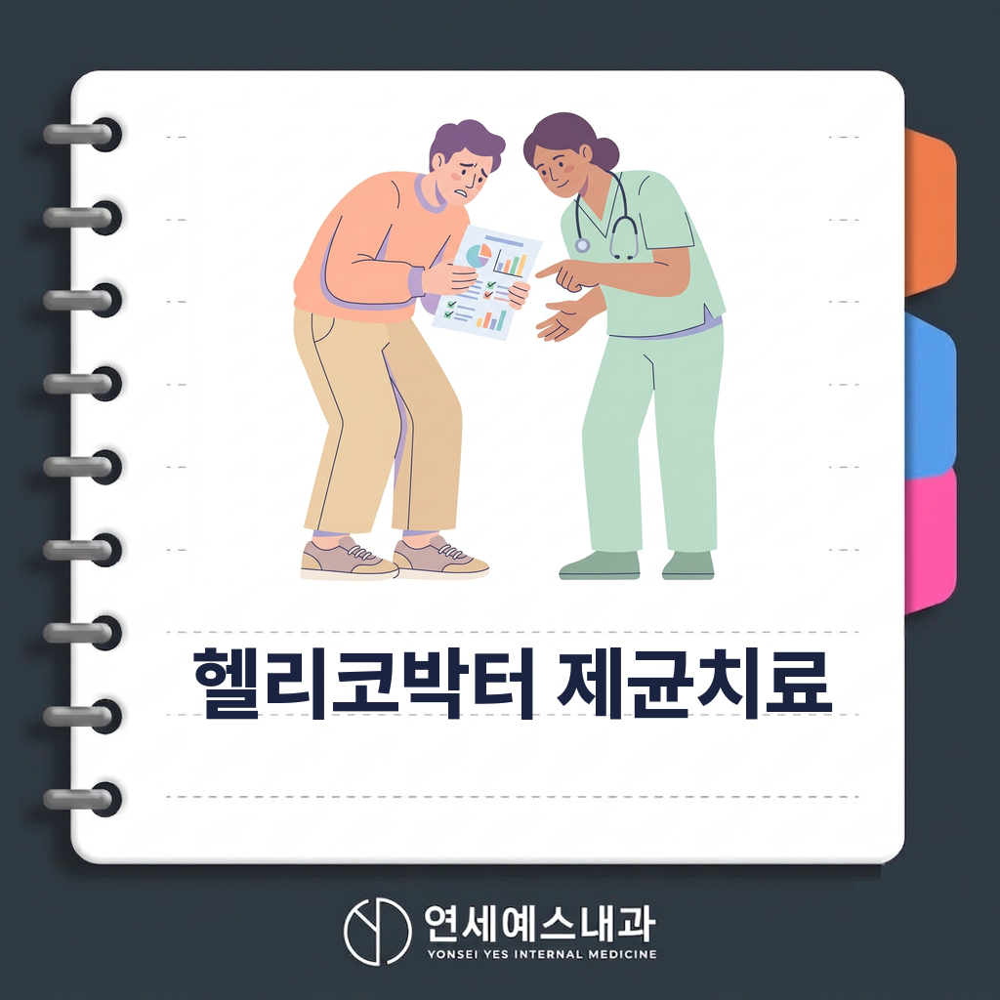
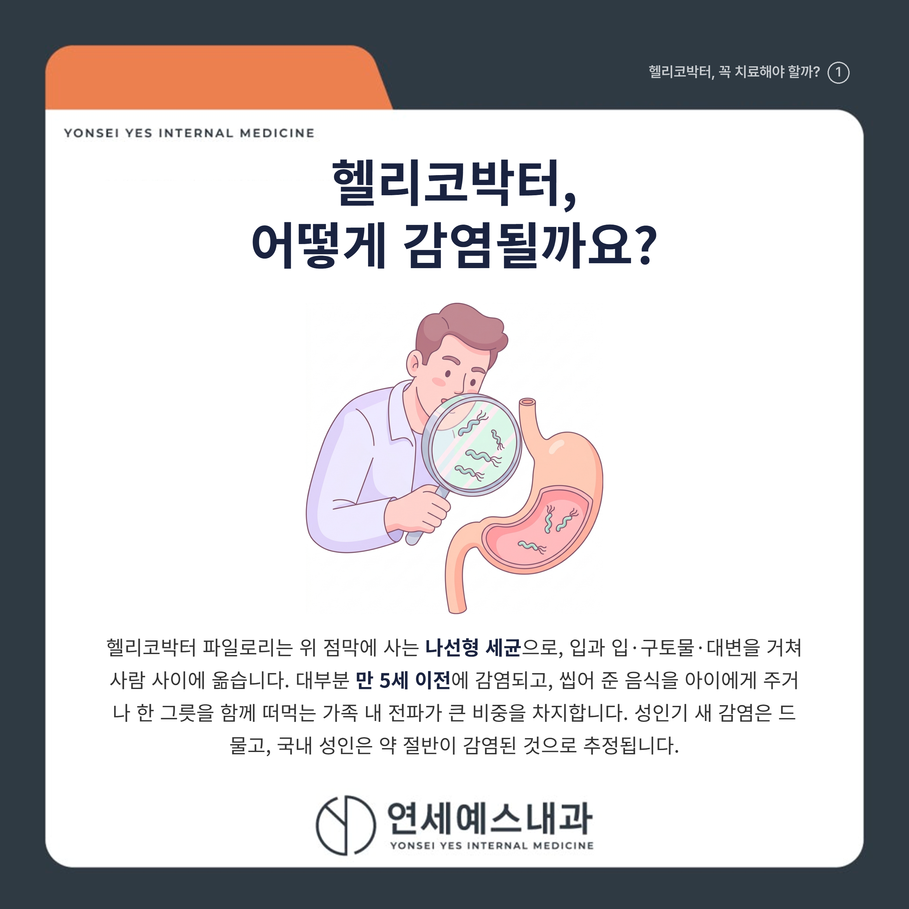
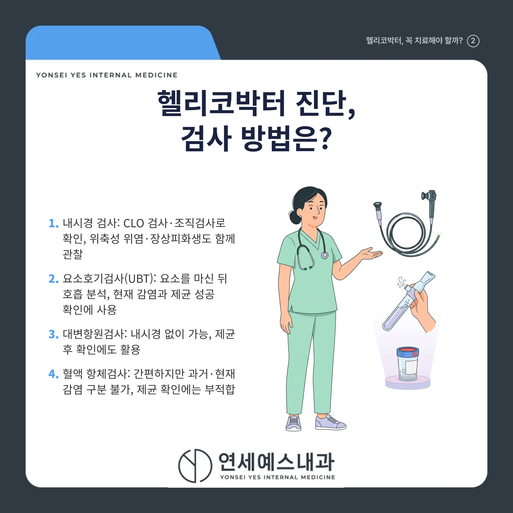
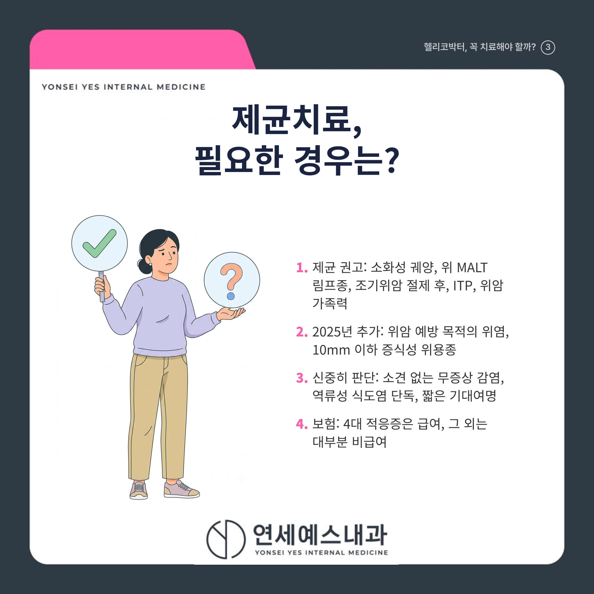
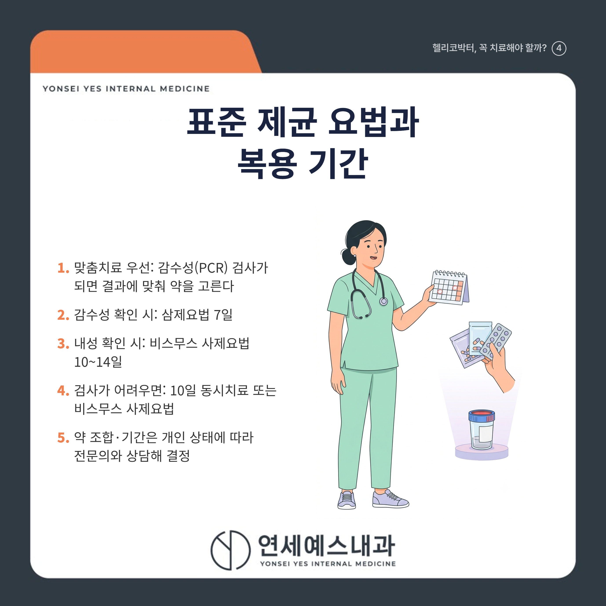
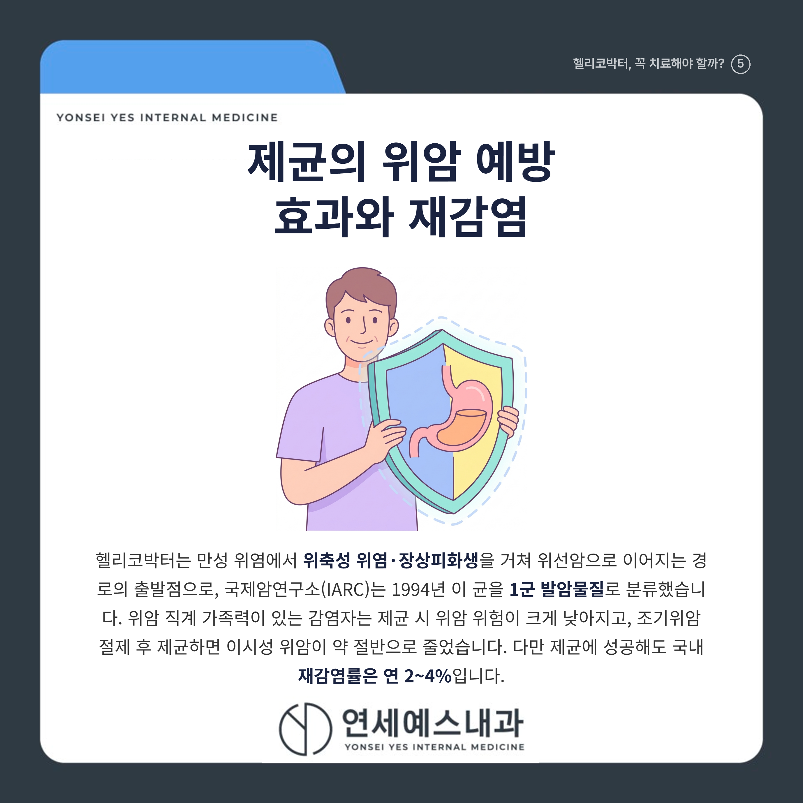
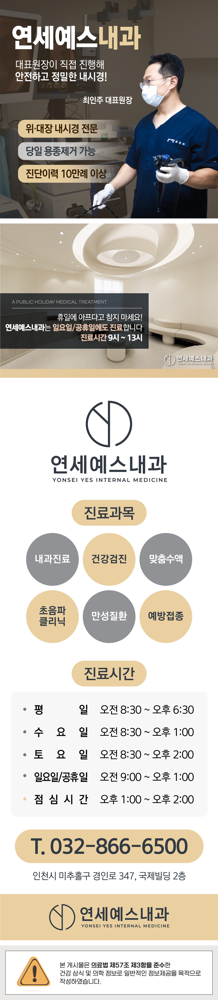

# 헬리코박터 제균치료, 필요한 경우와 아닌 경우

안녕하세요! 여러분의 건강 주치의 연세예스내과입니다. 😊

건강검진에서 위내시경을 받고 '헬리코박터 파일로리 양성'이라는 한 줄을 받아 들고 걱정부터 앞서셨던 적 있으시죠?

"양성이면 약을 꼭 먹어야 하나" 걱정하는 분도, "증상 없으니 그냥 두자"는 분도 많습니다.

결론부터 말씀드리면, 헬리코박터가 있다고 해서 모두 약을 먹는 것은 아닙니다. 소화성 궤양이나 위 MALT 림프종, 조기위암 절제 후, 위암 가족력이 있으면 제균이 권고되지만, 아무 소견이 없는 무증상 감염은 꼭 치료할 필요는 없습니다. 어떤 경우에 제균하고 언제 검사·재검하는지 아래에서 하나씩 짚어 드리겠습니다.

---

## 1. 🦠 헬리코박터, 어떻게 감염될까요?

헬리코박터 파일로리(Helicobacter pylori)는 위 점막에 사는 나선형 세균으로, 입과 입, 구토물, 대변을 거쳐 사람 사이에 옮습니다.

대부분 만 5세 이전에 감염되며, 씹어 준 음식을 아이에게 주거나 한 그릇을 함께 떠먹는 **가족 내 전파**가 큰 비중을 차지합니다. 성인기 새 감염은 드물고, 국내 성인은 약 절반이 감염된 것으로 추정됩니다.

---

## 2. 🔍 진단, 위내시경으로 하나요?

위내시경을 할 때는 신속요소분해효소검사(CLO test)나 조직검사로 확인하고, 조직검사로는 위축성 위염·장상피화생 같은 점막 변화도 함께 봅니다.

내시경 없이는 요소를 마시고 호흡을 분석하는 요소호기검사(UBT)나 대변항원검사를 쓰며, 현재 감염과 제균 성공 확인에 모두 씁니다.

혈액 항체검사는 간편하지만 ==과거 감염과 현재 감염을 구분하지 못하고, 제균 성공 뒤에도 항체가 남아 확인검사로는 부적합합니다.==

> ⚠️ 검사 전 약 조절이 필요합니다
> 위산분비억제제(PPI)는 2주, 항생제·비스무스는 4주 전에 끊어야 검사 위음성을 줄입니다. 복용 약을 임의로 끊지 말고 진료 시 알려 주세요.

---

## 3. ⚖️ 제균치료, 필요한 경우와 아닌 경우

소화성 궤양, 위 MALT 림프종, 조기위암 내시경 절제 후, 특발성 혈소판감소성 자반병(ITP)은 **제균이 확실히 권고되는** 대표 적응증입니다. 2025년 개정 지침부터는 위암 예방 목적의 위염과 10mm 이하 증식성 위용종도 새로 대상에 들어왔습니다.

반대로 아무 소견이 없는 무증상 감염은 정식 권고 대상이 아니라 원하면 비급여로 치료하는 정도이고, 역류성 식도염만으로는 제균 근거가 부족합니다.

| 구분 | 제균 권고 | 신중히 판단 |
|------|----------|------------|
| 대상 | 소화성 궤양, MALT 림프종, 조기위암 절제 후, ITP, 위암 가족력 | 소견 없는 무증상, 역류성 식도염 단독, 짧은 기대여명 |
| 보험 | 4대 적응증 급여 | 대부분 비급여 |

---

## 4. 💊 표준 제균 요법과 기간

클래리스로마이신 내성률이 33.3%까지 오르면서, 2025 지침은 감수성(PCR) 검사가 되면 맞춤치료를 먼저 권합니다. 감수성이면 삼제요법 7일, 내성이면 비스무스 사제요법 10~14일입니다.

검사가 어려우면 네 가지 약을 쓰는 10일 동시치료나 비스무스 사제요법을 씁니다. 약 조합과 기간은 개인 상태에 따라 달라지므로 전문의와 상담해 정합니다.

## Q. 제균이 잘 됐는지 재검은 언제 하나요?

항생제를 끝낸 뒤 **최소 4주**가 지나 요소호기검사나 대변항원검사로 확인합니다. 너무 일찍 하면 균이 잠시 억눌려 위음성이 나올 수 있습니다.

이때도 PPI 2주, 항생제·비스무스 4주 중단이 필요하며, 1차 치료에 실패하면 2차 요법 뒤 다시 4주 후 재확인합니다.

---

## 5. 🩺 위암 예방 효과와 재감염

헬리코박터는 만성 위염에서 위축성 위염, 장상피화생을 거쳐 위선암으로 이어지는 경로의 출발점입니다. 국제암연구소(IARC)는 1994년 이 균을 1군 발암물질로 분류했습니다.

위암 직계 가족력이 있는 감염자는 제균 시 위암 위험이 55% 낮았고(HR 0.27), 조기위암 절제 후 제균하면 이시성 위암이 약 50% 줄었습니다. 다만 위축·장상피화생이 넓게 진행된 뒤에는 예방 효과가 줄어 이른 제균이 유리합니다.

제균에 성공해도 국내 재감염률은 연 2~4%로, 대부분 새로운 균주에 의한 재감염입니다.

---

## 6. 🩺 언제 병원에 가야 하나요?

건강검진에서 헬리코박터 양성이 나왔거나 속쓰림·명치 통증·소화불량이 반복되면, 내과에서 제균이 필요한 경우인지 상담해 보시는 것이 좋습니다.

위·십이지장 궤양을 앓은 적이 있거나 부모·형제 중 위암 병력이 있다면 제균 대상에 해당하니 미루지 마세요. 제균 치료를 마쳤다면 4주가 지나 확인검사를 받고, 이후 증상이 다시 생기면 재감염 여부를 확인합니다.

---

## ✅ 한눈에 정리

[   ] 헬리코박터는 대부분 5세 이전 가족 내 감염, 국내 성인 약 절반 보유

[   ] 진단은 내시경 조직검사 또는 요소호기·대변항원검사, 항체검사는 확인용 부적합

[   ] 소화성 궤양·MALT 림프종·조기위암 절제 후·위암 가족력은 제균 권고, 무증상은 선택

[   ] 재검은 항생제 종료 4주 후, 성공해도 연 2~4%는 재감염

> "헬리코박터 양성 한 줄은 겁낼 일도, 무시할 일도 아닌 확인이 필요한 신호입니다."

헬리코박터가 확인됐다면 제균이 필요한지 가까운 내과에서 전문의와 상담해 보시기 바랍니다.

---

※ 모든 치료 및 예방접종은 개인의 상태에 따라 발열, 통증, 알레르기 반응 등의 부작용이 나타날 수 있으므로, 반드시 의료진과 충분한 상담 후 진행하시기 바랍니다.

연세예스내과에서 전해드리는 건강 정보였습니다. 오늘도 건강하고 평안한 하루 보내세요!

---

#헬리코박터 #제균치료 #위내시경 #미추홀내과의원 #옛시민회관내과 #옛시민회관의원 #옛시민회관내과의원 #옛시민회관사거리내과 #옛시민회관사거리의원 #옛시민회관사거리내과의원
